# UniFi Camera Manager Architecture

This document provides a comprehensive overview of the UniFi Camera Manager (`ucam`) architecture, including module relationships, data flows, and API integrations.

## Table of Contents

- [High-Level Architecture](#high-level-architecture)
- [Module Overview](#module-overview)
- [CLI Command Structure](#cli-command-structure)
- [API Integration Layers](#api-integration-layers)
- [Configuration System](#configuration-system)
- [Authentication Flows](#authentication-flows)
- [Data Models](#data-models)

---

## High-Level Architecture

The UniFi Camera Manager is a CLI tool that integrates with three distinct API systems to provide unified camera management capabilities.

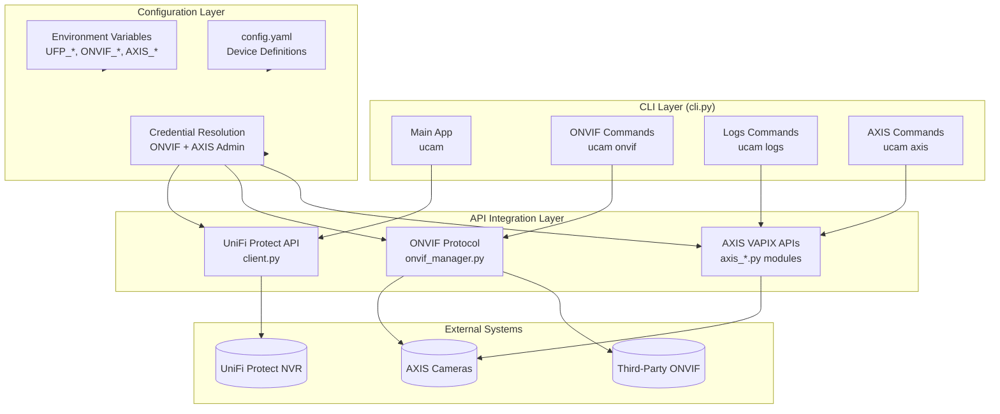

---

## Module Overview

The package consists of 12 Python modules organized into functional groups:

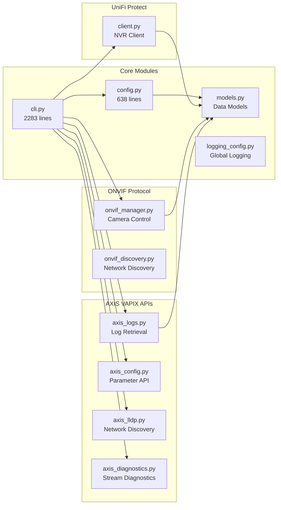

### Module Descriptions

| Module | Lines | Purpose |
|--------|-------|---------|
| `cli.py` | 2283 | Main CLI with Typer, command groups, Rich output |
| `config.py` | 638 | XDG-compliant configuration, credential resolution |
| `models.py` | ~300 | Pydantic v2 data models with validation |
| `logging_config.py` | ~100 | Global logging configuration |
| `client.py` | ~400 | UniFi Protect NVR API client |
| `onvif_manager.py` | ~600 | ONVIF protocol implementation |
| `onvif_discovery.py` | ~200 | ONVIF camera discovery utilities |
| `axis_logs.py` | 409 | VAPIX serverreport.cgi log retrieval |
| `axis_config.py` | ~350 | VAPIX v2beta parameter API |
| `axis_lldp.py` | ~200 | VAPIX LLDP REST API |
| `axis_diagnostics.py` | ~300 | Stream and network diagnostics |

---

## CLI Command Structure

The CLI is built with Typer and organized into four command groups:

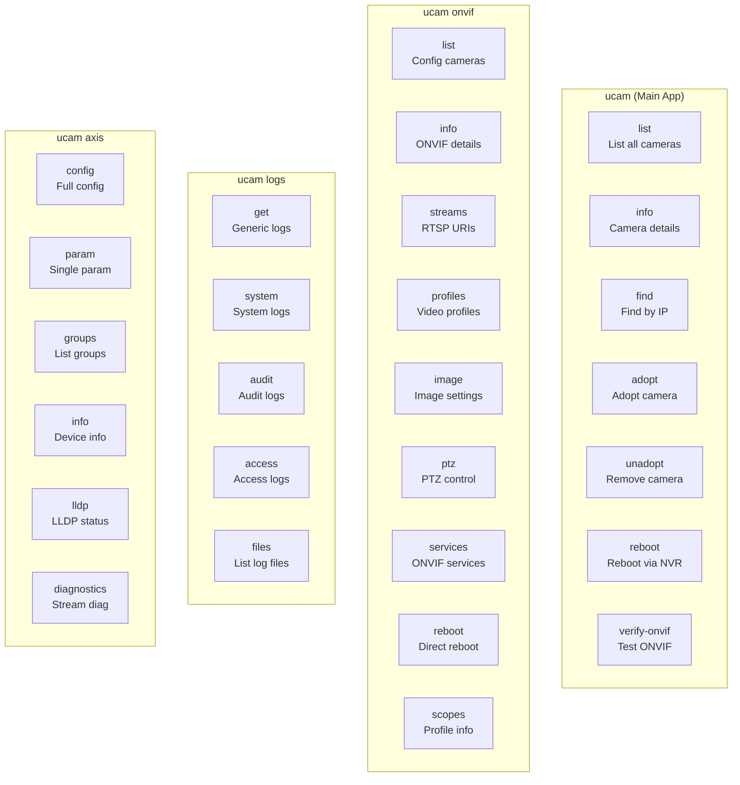

### Command Options Pattern

All commands follow consistent patterns:

```
--camera, -c     Camera name from config.yaml (with shell completion)
--ip             Direct IP address access
--user, -u       Override username
--pass, -p       Override password
--port           Override port (default: 80)
--env, -e        Path to .env file (UniFi Protect commands)
```

---

## API Integration Layers

### UniFi Protect API

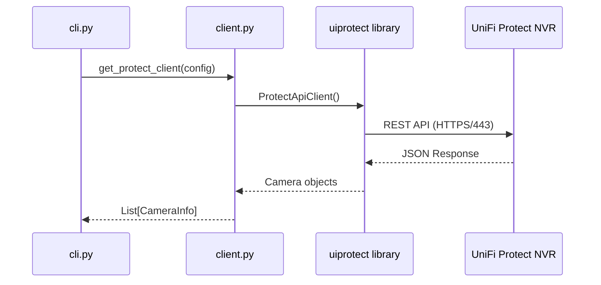

### ONVIF Protocol

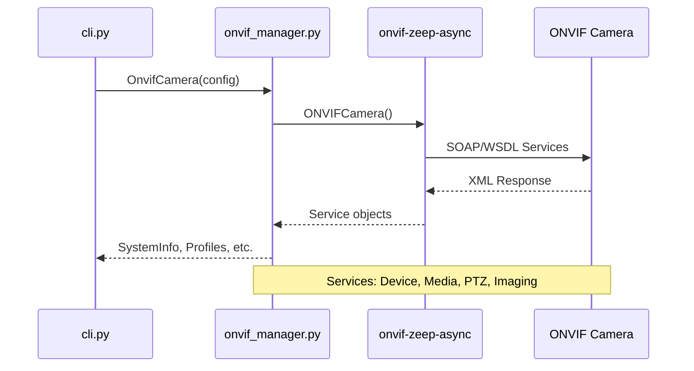

### AXIS VAPIX APIs

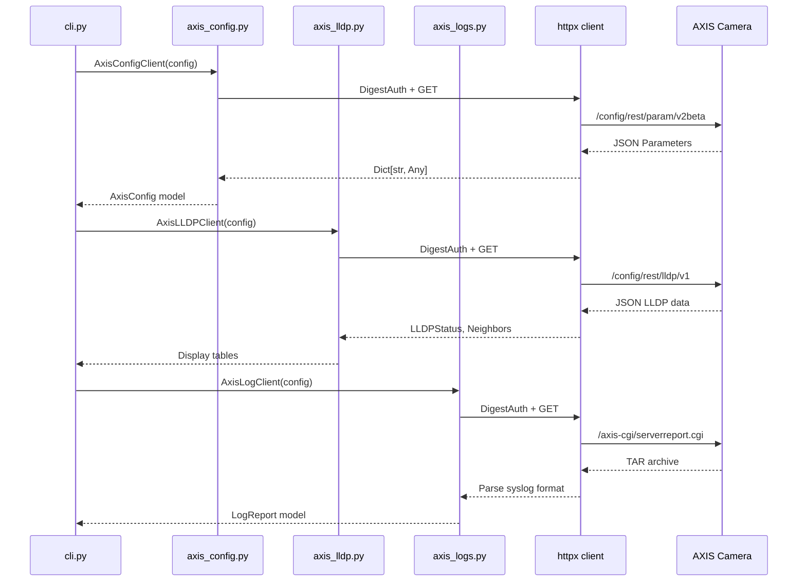

---

## Configuration System

### Configuration Resolution Priority

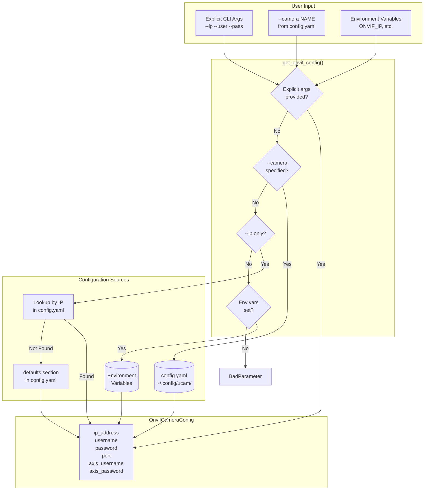

### XDG Directory Structure

```
~/.config/ucam/
├── config.yaml          # Device definitions + defaults
└── .env                  # Optional environment overrides

~/.local/share/ucam/
└── protect_cameras.json  # Cache for shell completions
```

### config.yaml Structure

```yaml
# Default credentials (used with --ip only)
defaults:
  username: "${AXIS_ADMIN_USERNAME}"
  password: "${AXIS_ADMIN_PASSWORD}"
  port: 80

# Device definitions
devices:
  - name: Front_Of_House
    address: 192.168.10.12
    username: onvif_user
    password: onvif_pass
    port: 80
    vendor: AXIS
    model: P3245-V
    type: camera
    # AXIS admin credentials (for VAPIX APIs)
    axis_username: "${AXIS_ADMIN_USERNAME}"
    axis_password: "${AXIS_ADMIN_PASSWORD}"
```

---

## Authentication Flows

### Dual Credential System

AXIS cameras require different credentials for different APIs:

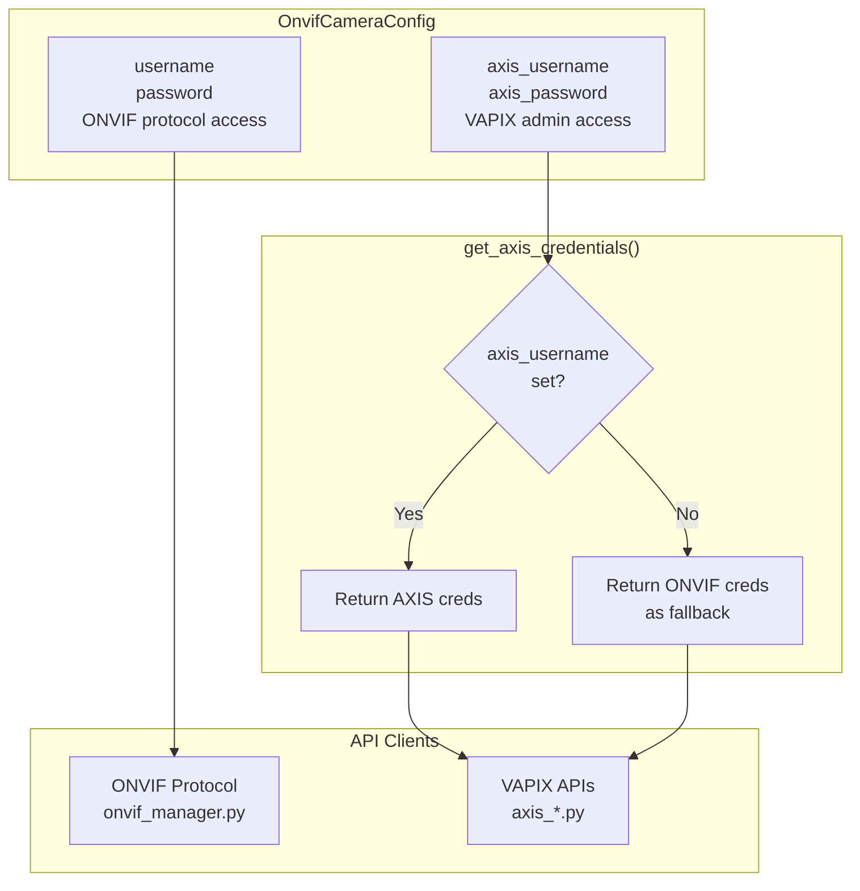

### HTTP Digest Authentication

All AXIS VAPIX clients use HTTP Digest authentication:

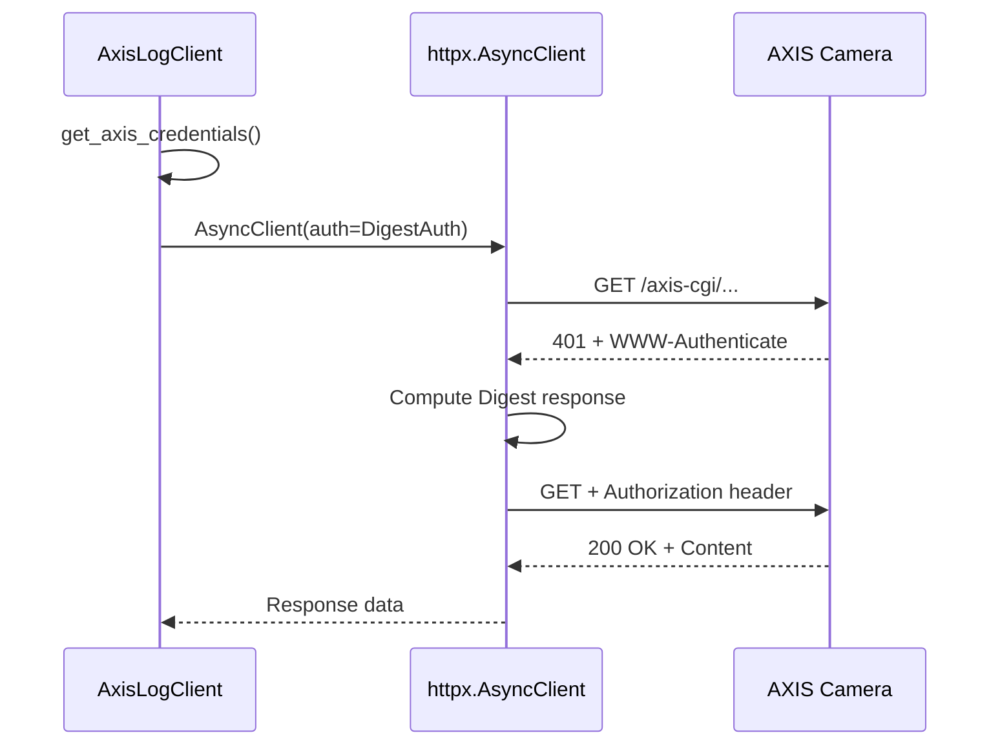

---

## Data Models

### Model Hierarchy

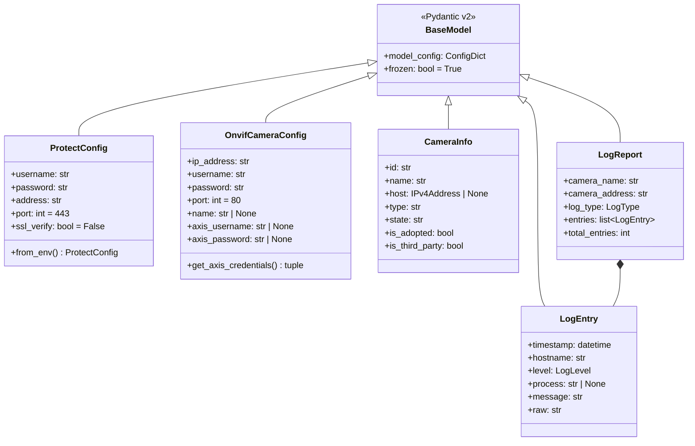

### Enumerations

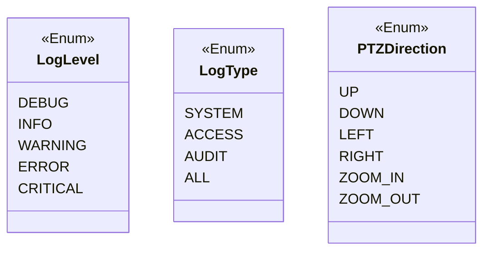

---

## Async Context Manager Pattern

All API clients follow the async context manager pattern:

```python
async with AxisLogClient(config) as client:
    logs = await client.get_system_logs()
```

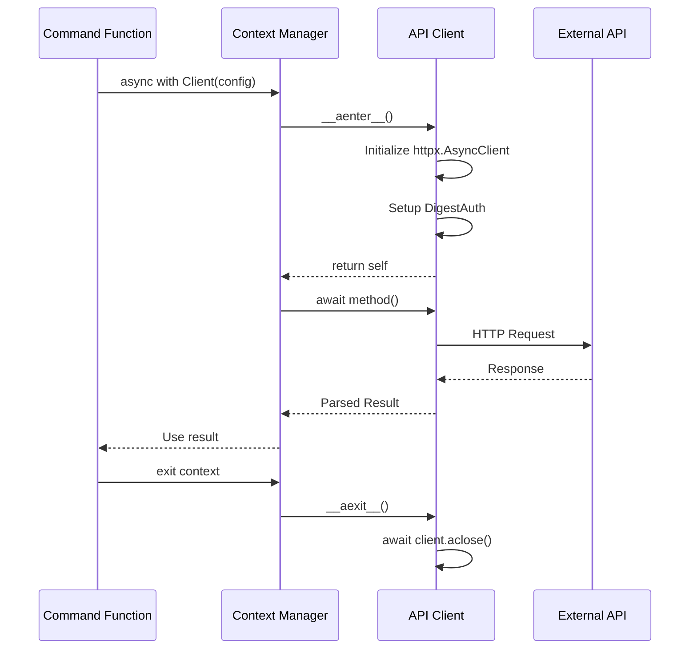

---

## Error Handling

### HTTP Status Code Handling

```mermaid
flowchart TB
    REQUEST[HTTP Request] --> RESPONSE{Status Code}

    RESPONSE -->|200| SUCCESS[Parse Response]
    RESPONSE -->|401| AUTH_ERROR[Authentication Failed]
    RESPONSE -->|404| NOT_FOUND[Resource Not Found]
    RESPONSE -->|500| SERVER_ERROR[Server Error]

    AUTH_ERROR --> DISPLAY_401[Display: Check credentials<br/>in config.yaml]
    NOT_FOUND --> DISPLAY_404[Display: Camera not found]
    SERVER_ERROR --> DISPLAY_500[Display: Camera error]

    SUCCESS --> RETURN[Return to CLI]
    DISPLAY_401 --> EXIT[typer.Exit(1)]
    DISPLAY_404 --> EXIT
    DISPLAY_500 --> EXIT
```

### CLI Error Display

All errors are displayed using Rich console with consistent formatting:
- `[red]Error:[/red]` prefix for errors
- `[yellow]Warning:[/yellow]` prefix for warnings
- `[dim]Note:[/dim]` prefix for hints
- Exit code 1 for all error conditions

---

## Testing Architecture

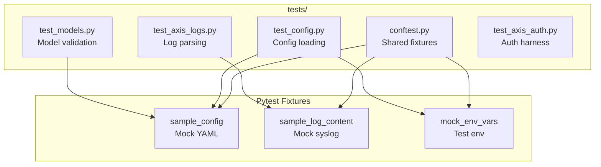

Run tests with:
```bash
uv run pytest -v              # Verbose output
uv run pytest --cov           # With coverage
uv run pytest -k "test_config"  # Specific tests
```

---

## Future Considerations

### Potential Enhancements

1. **Event Subscription**: ONVIF event polling for motion detection
2. **Firmware Management**: AXIS firmware update via VAPIX
3. **Recording Control**: UniFi Protect recording schedule management
4. **Multi-NVR Support**: Managing cameras across multiple NVRs
5. **Configuration Backup**: Export/import camera settings

### Extension Points

- Add new AXIS VAPIX APIs in `axis_*.py` modules
- Add new CLI commands in command groups
- Add new Pydantic models in `models.py`
- Configuration sources in `config.py`
