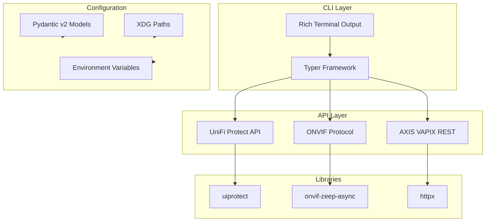

# UniFi Camera Manager Documentation

> Comprehensive documentation for the `ucam` CLI tool - managing UniFi Protect cameras and third-party ONVIF/AXIS cameras.

## Overview

UniFi Camera Manager (`ucam`) is a Python CLI tool that provides unified access to:

1. **UniFi Protect NVR** - List, adopt, unadopt, and manage cameras through the NVR
2. **ONVIF Protocol** - Direct camera control (PTZ, streams, profiles, imaging)
3. **AXIS VAPIX API** - Vendor-specific features (logs, config, LLDP, diagnostics)

## Documentation Structure

| Document | Description |
|----------|-------------|
| [Architecture](ARCHITECTURE.md) | System design with Mermaid diagrams |
| [Workflows](workflows.md) | Core operational workflows |
| [API Reference](api-reference.md) | Interface and model documentation |
| [Modules](modules/) | Per-module detailed documentation |

## Module Index

| Module | Purpose | API System |
|--------|---------|------------|
| [cli.py](modules/cli.md) | Typer CLI commands (4 groups, 27 commands) | All |
| [client.py](modules/client.md) | UniFi Protect API wrapper | UniFi Protect |
| [onvif_manager.py](modules/onvif_manager.md) | ONVIF camera operations | ONVIF |
| [onvif_discovery.py](modules/onvif_discovery.md) | ONVIF verification | ONVIF |
| [axis_logs.py](modules/axis_logs.md) | AXIS log retrieval (VAPIX) | AXIS VAPIX |
| [axis_config.py](modules/axis_config.md) | AXIS configuration (VAPIX) | AXIS VAPIX |
| [axis_lldp.py](modules/axis_lldp.md) | AXIS LLDP discovery (VAPIX) | AXIS VAPIX |
| [axis_diagnostics.py](modules/axis_diagnostics.md) | AXIS stream diagnostics (VAPIX) | AXIS VAPIX |
| [config.py](modules/config.md) | Configuration management | N/A |
| [models.py](modules/models.md) | Pydantic data models | N/A |
| [logging_config.py](modules/logging_config.md) | Logging configuration | N/A |

## Quick Start

```bash
# Install
uv sync

# Configure environment
export UFP_USERNAME=admin
export UFP_PASSWORD=secret
export UFP_ADDRESS=192.168.1.1

# Run commands
uv run ucam list                          # List NVR cameras
uv run ucam onvif info --camera "Front"   # ONVIF camera info
uv run ucam logs system --camera "Front"  # AXIS logs
uv run ucam axis lldp --camera "Front"    # LLDP neighbors
```

## Technology Stack



## Version

- **Python**: 3.12+
- **Package Manager**: uv (recommended) or pip
- **Current Version**: See `pyproject.toml`

## License & Acknowledgments

This project is licensed under the **MIT License** - see [LICENSE.md](../LICENSE.md).

Special thanks to the [uiprotect](https://github.com/uilibs/uiprotect) library maintainers for their excellent UniFi Protect API client that made this project possible. See [Acknowledgments](../README.md#acknowledgments) in the README for details.
