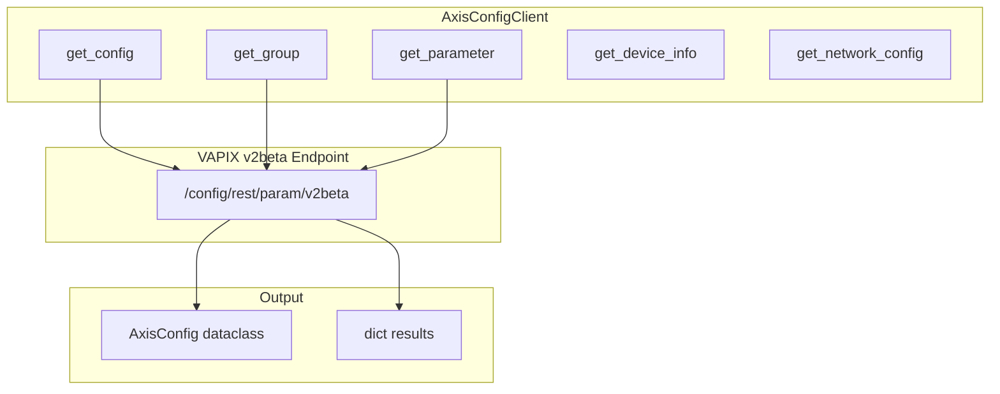
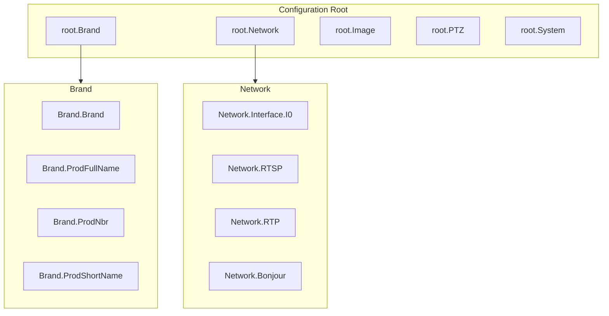
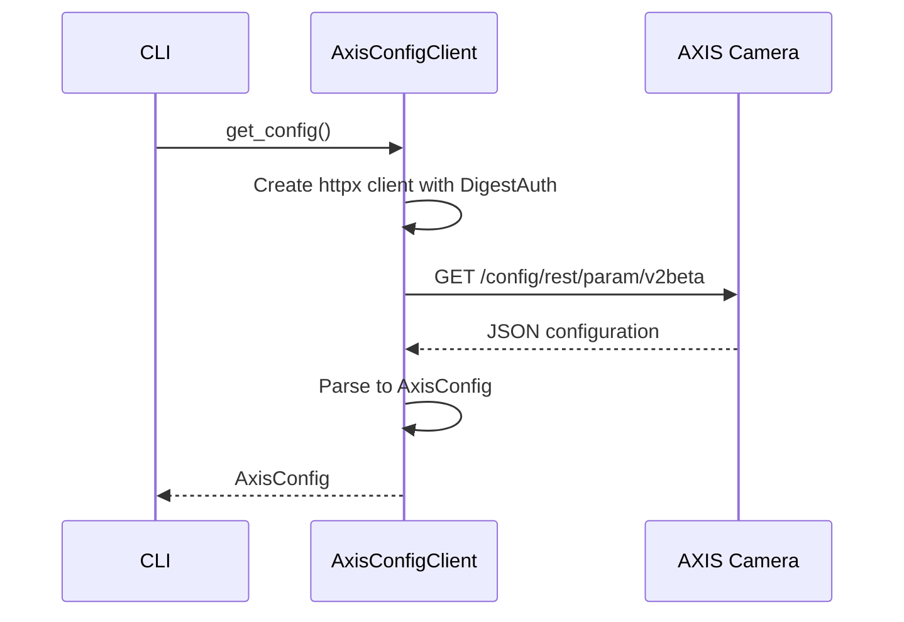

# axis_config.py - AXIS Configuration Management

> AXIS camera parameter configuration via VAPIX v2beta REST API.

## Overview

This module provides `AxisConfigClient` for reading camera configuration parameters from AXIS cameras. It uses the VAPIX `/config/rest/param/v2beta` endpoint to retrieve structured configuration data.

## Architecture



## Class: AxisConfigClient

### Initialization

```python
class AxisConfigClient:
    """AXIS VAPIX parameter API client."""

    def __init__(
        self,
        config: OnvifCameraConfig,
        timeout: float = 30.0,
    ) -> None:
        """Initialize config client.

        Args:
            config: Camera configuration with credentials.
            timeout: HTTP request timeout in seconds.
        """
```

### Methods

| Method | Returns | Description |
|--------|---------|-------------|
| `get_config()` | `AxisConfig` | Get full configuration |
| `get_group()` | `dict` | Get specific parameter group |
| `get_parameter()` | `Any` | Get individual parameter |
| `get_device_info()` | `dict` | Get device information |
| `get_network_config()` | `dict` | Get network configuration |
| `get_image_config()` | `dict` | Get image settings |
| `get_ptz_config()` | `dict` | Get PTZ configuration |

## AxisConfig Dataclass

```python
@dataclass
class AxisConfig:
    """AXIS camera configuration container.

    Provides methods for navigating and searching the
    hierarchical parameter structure.
    """

    data: dict[str, Any]
    camera_name: str
    camera_address: str
    retrieved_at: str

    def get_param(self, path: str) -> Any:
        """Get parameter by dot-separated path.

        Example: config.get_param("root.Network.Interface.I0.Active")
        """

    def search_params(self, query: str) -> dict[str, Any]:
        """Search parameters by name pattern.

        Example: config.search_params("Network")
        """

    def flatten(self) -> dict[str, Any]:
        """Flatten hierarchical config to dot-notation keys."""

    def get_groups(self) -> list[str]:
        """Get list of top-level parameter groups."""
```

## Configuration Hierarchy



## Request Flow



## Parameter Navigation

### get_param()

Navigate to specific parameters using dot notation:

```python
config = await client.get_config()

# Get device brand
brand = config.get_param("root.Brand.Brand")
# Returns: "AXIS"

# Get network interface status
active = config.get_param("root.Network.Interface.I0.Active")
# Returns: "yes" or "no"

# Get firmware version
firmware = config.get_param("root.Properties.Firmware.Version")
```

### search_params()

Search for parameters by name pattern:

```python
# Find all network-related parameters
network_params = config.search_params("Network")
# Returns: {"root.Network.Interface.I0.Active": "yes", ...}

# Find all RTSP parameters
rtsp_params = config.search_params("RTSP")
```

### flatten()

Convert hierarchical structure to flat dictionary:

```python
flat = config.flatten()
# Returns:
# {
#     "root.Brand.Brand": "AXIS",
#     "root.Brand.ProdFullName": "AXIS P3245-V",
#     "root.Network.Interface.I0.Active": "yes",
#     ...
# }
```

## Common Parameter Groups

| Group | Description | Example Parameters |
|-------|-------------|-------------------|
| `Brand` | Device branding | Brand, ProdFullName, ProdNbr |
| `Network` | Network settings | Interface, RTSP, RTP, DNS |
| `Image` | Image settings | Appearance, Overlay, Text |
| `PTZ` | PTZ configuration | Limits, Presets, Patrol |
| `System` | System settings | SerialNumber, DateTime |
| `Properties` | Device properties | Firmware.Version, API.Version |

## Authentication

Uses HTTP Digest authentication for secure parameter access:

```python
async def _get_client(self) -> httpx.AsyncClient:
    """Get authenticated HTTP client."""
    if self._client is None:
        username, password = self._config.get_axis_credentials()
        self._client = httpx.AsyncClient(
            auth=httpx.DigestAuth(username, password),
            timeout=self._timeout,
            verify=False,
        )
    return self._client
```

## Usage Example

```python
from unifi_camera_manager.axis_config import AxisConfigClient
from unifi_camera_manager.config import OnvifCameraConfig

async def main():
    config = OnvifCameraConfig(
        ip_address="192.168.1.100",
        username="admin",
        password="password",
    )

    async with AxisConfigClient(config) as client:
        # Get full configuration
        axis_config = await client.get_config()

        # Navigate to specific parameters
        brand = axis_config.get_param("root.Brand.Brand")
        print(f"Brand: {brand}")

        # Get device info
        device_info = await client.get_device_info()
        print(f"Model: {device_info.get('ProdFullName')}")

        # Get network configuration
        network = await client.get_network_config()
        print(f"DHCP: {network.get('Interface', {}).get('I0', {}).get('DHCP')}")

        # Search for parameters
        rtsp_params = axis_config.search_params("RTSP")
        for key, value in rtsp_params.items():
            print(f"{key}: {value}")

        # List all groups
        groups = axis_config.get_groups()
        print(f"Available groups: {groups}")
```

## CLI Integration

```bash
# Get full configuration
uv run ucam axis config --camera "Front Door"

# Get specific group
uv run ucam axis config --camera "Front Door" --group Network

# Get individual parameter
uv run ucam axis param --camera "Front Door" --name root.Brand.Brand

# Get device information
uv run ucam axis info --camera "Front Door"
```

## Error Handling

```python
async def get_config(self) -> AxisConfig:
    """Get configuration with error handling."""
    try:
        response = await client.get(url)
        response.raise_for_status()
        return AxisConfig(
            data=response.json(),
            camera_name=self._config.name or self._config.ip_address,
            camera_address=self._config.ip_address,
            retrieved_at=datetime.now().isoformat(),
        )
    except httpx.HTTPStatusError as e:
        if e.response.status_code == 401:
            raise AuthenticationError("Invalid credentials")
        if e.response.status_code == 404:
            raise NotFoundError("Parameter API not available")
        raise
```

## Dependencies

- **httpx**: Async HTTP client with Digest auth
- **dataclasses**: AxisConfig container
