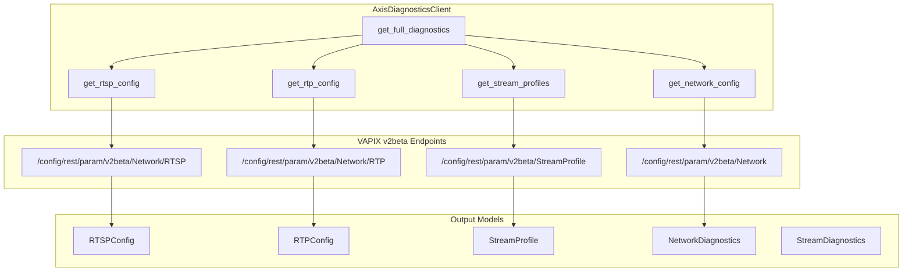
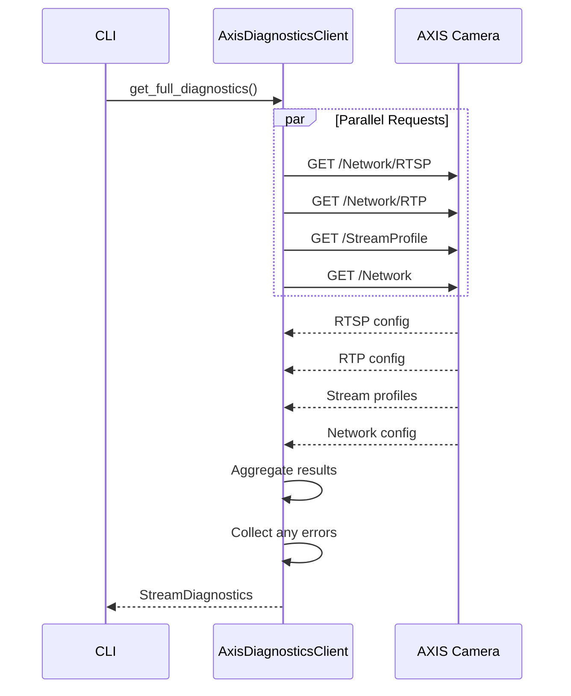
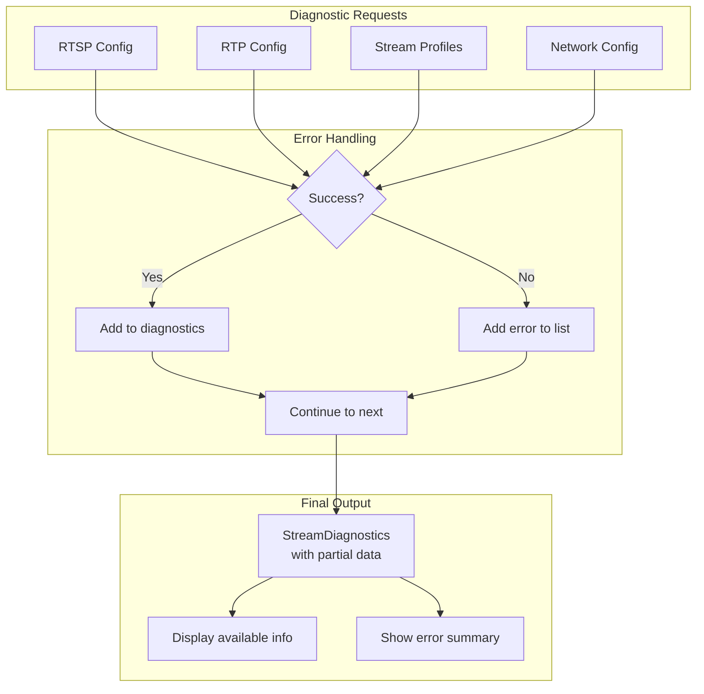

# axis_diagnostics.py - AXIS Stream Diagnostics

> AXIS camera stream and network diagnostics via VAPIX v2beta REST API.

## Overview

This module provides `AxisDiagnosticsClient` for retrieving streaming and network diagnostic information from AXIS cameras. It aggregates data from multiple VAPIX endpoints to provide a comprehensive view of the camera's streaming configuration.

## Architecture



## Class: AxisDiagnosticsClient

### Initialization

```python
class AxisDiagnosticsClient:
    """AXIS stream diagnostics client."""

    def __init__(
        self,
        config: OnvifCameraConfig,
        timeout: float = 30.0,
    ) -> None:
        """Initialize diagnostics client.

        Args:
            config: Camera configuration with credentials.
            timeout: HTTP request timeout in seconds.
        """
```

### Methods

| Method | Returns | Description |
|--------|---------|-------------|
| `get_rtsp_config()` | `RTSPConfig` | Get RTSP server settings |
| `get_rtp_config()` | `RTPConfig` | Get RTP streaming settings |
| `get_stream_profiles()` | `list[StreamProfile]` | Get stream profile configs |
| `get_network_config()` | `NetworkDiagnostics` | Get network diagnostics |
| `get_full_diagnostics()` | `StreamDiagnostics` | Get all diagnostics combined |

## Data Models

### RTSPConfig

```python
@dataclass
class RTSPConfig:
    """RTSP server configuration."""

    enabled: bool
    port: int
    authentication: str  # none, basic, digest
    timeout: int
    multicast_enabled: bool
```

### RTPConfig

```python
@dataclass
class RTPConfig:
    """RTP streaming configuration."""

    start_port: int
    end_port: int
    multicast_ttl: int
```

### StreamProfile

```python
@dataclass
class StreamProfile:
    """Video stream profile configuration."""

    name: str
    description: str
    encoding: str  # H.264, H.265, MJPEG
    resolution: str
    frame_rate: int
    bitrate: int | None
    gop_length: int | None
```

### NetworkDiagnostics

```python
@dataclass
class NetworkDiagnostics:
    """Network configuration diagnostics."""

    interface: str
    ip_address: str
    subnet_mask: str
    gateway: str
    dns_servers: list[str]
    mtu: int
    speed: str  # 10/100/1000
    duplex: str  # half/full
```

### StreamDiagnostics

```python
@dataclass
class StreamDiagnostics:
    """Combined stream diagnostics."""

    rtsp: RTSPConfig | None
    rtp: RTPConfig | None
    profiles: list[StreamProfile]
    network: NetworkDiagnostics | None
    errors: list[str]
    camera_name: str
    camera_address: str
    retrieved_at: str
```

## Diagnostics Flow



## Graceful Degradation

The diagnostics client handles partial failures gracefully:



### Implementation

```python
async def get_full_diagnostics(self) -> StreamDiagnostics:
    """Get all diagnostics with graceful error handling."""
    errors: list[str] = []
    rtsp_config = None
    rtp_config = None
    profiles: list[StreamProfile] = []
    network_config = None

    # RTSP configuration
    try:
        rtsp_config = await self.get_rtsp_config()
    except Exception as e:
        errors.append(f"RTSP config: {e}")

    # RTP configuration
    try:
        rtp_config = await self.get_rtp_config()
    except Exception as e:
        errors.append(f"RTP config: {e}")

    # Stream profiles
    try:
        profiles = await self.get_stream_profiles()
    except Exception as e:
        errors.append(f"Stream profiles: {e}")

    # Network configuration
    try:
        network_config = await self.get_network_config()
    except Exception as e:
        errors.append(f"Network config: {e}")

    return StreamDiagnostics(
        rtsp=rtsp_config,
        rtp=rtp_config,
        profiles=profiles,
        network=network_config,
        errors=errors,
        camera_name=self._config.name or self._config.ip_address,
        camera_address=self._config.ip_address,
        retrieved_at=datetime.now().isoformat(),
    )
```

## Usage Example

```python
from unifi_camera_manager.axis_diagnostics import AxisDiagnosticsClient
from unifi_camera_manager.config import OnvifCameraConfig

async def main():
    config = OnvifCameraConfig(
        ip_address="192.168.1.100",
        username="admin",
        password="password",
    )

    async with AxisDiagnosticsClient(config) as client:
        # Get full diagnostics
        diag = await client.get_full_diagnostics()

        # RTSP settings
        if diag.rtsp:
            print(f"RTSP Port: {diag.rtsp.port}")
            print(f"Authentication: {diag.rtsp.authentication}")

        # RTP settings
        if diag.rtp:
            print(f"RTP Ports: {diag.rtp.start_port}-{diag.rtp.end_port}")

        # Stream profiles
        for profile in diag.profiles:
            print(f"Profile: {profile.name}")
            print(f"  Encoding: {profile.encoding}")
            print(f"  Resolution: {profile.resolution}")
            print(f"  Frame Rate: {profile.frame_rate} fps")

        # Network
        if diag.network:
            print(f"IP: {diag.network.ip_address}")
            print(f"Speed: {diag.network.speed} {diag.network.duplex}")

        # Errors
        if diag.errors:
            print("Errors encountered:")
            for error in diag.errors:
                print(f"  - {error}")
```

## CLI Integration

```bash
# Run full diagnostics
uv run ucam axis diagnostics --camera "Front Door"

# Output example:
# Stream Diagnostics for Front Door (192.168.1.100)
#
# RTSP Configuration:
#   Port: 554
#   Authentication: digest
#   Multicast: disabled
#
# RTP Configuration:
#   Port Range: 50000-50999
#   Multicast TTL: 5
#
# Stream Profiles:
#   Profile 1: H.264, 1920x1080, 30fps, 4000kbps
#   Profile 2: H.264, 640x480, 15fps, 500kbps
#
# Network:
#   IP: 192.168.1.100/24
#   Gateway: 192.168.1.1
#   Speed: 1000Mbps Full Duplex
#   MTU: 1500
```

## Use Cases

### Stream Troubleshooting

Diagnose streaming issues by checking configuration:

```python
async def troubleshoot_streaming(config: OnvifCameraConfig):
    """Diagnose streaming configuration."""
    async with AxisDiagnosticsClient(config) as client:
        diag = await client.get_full_diagnostics()

        # Check RTSP
        if diag.rtsp:
            if not diag.rtsp.enabled:
                print("⚠️ RTSP server is disabled")
            if diag.rtsp.authentication == "none":
                print("⚠️ No RTSP authentication configured")
        else:
            print("❌ Could not retrieve RTSP config")

        # Check network speed
        if diag.network:
            if "1000" not in diag.network.speed:
                print(f"⚠️ Camera running at {diag.network.speed}")
```

### Configuration Audit

Audit camera configurations across multiple devices:

```python
async def audit_cameras(cameras: list[OnvifCameraConfig]):
    """Audit streaming configuration across cameras."""
    for config in cameras:
        async with AxisDiagnosticsClient(config) as client:
            diag = await client.get_full_diagnostics()
            print(f"\n{config.name}:")
            print(f"  RTSP Auth: {diag.rtsp.authentication if diag.rtsp else 'N/A'}")
            print(f"  Profiles: {len(diag.profiles)}")
            print(f"  Errors: {len(diag.errors)}")
```

## Dependencies

- **httpx**: Async HTTP client with Digest auth
- **dataclasses**: Data models for diagnostics
