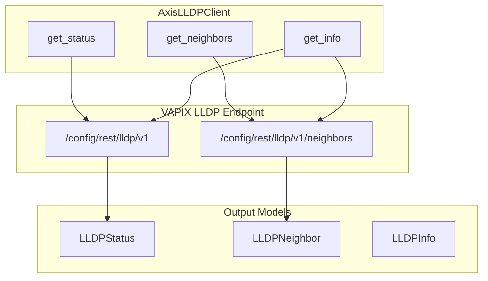
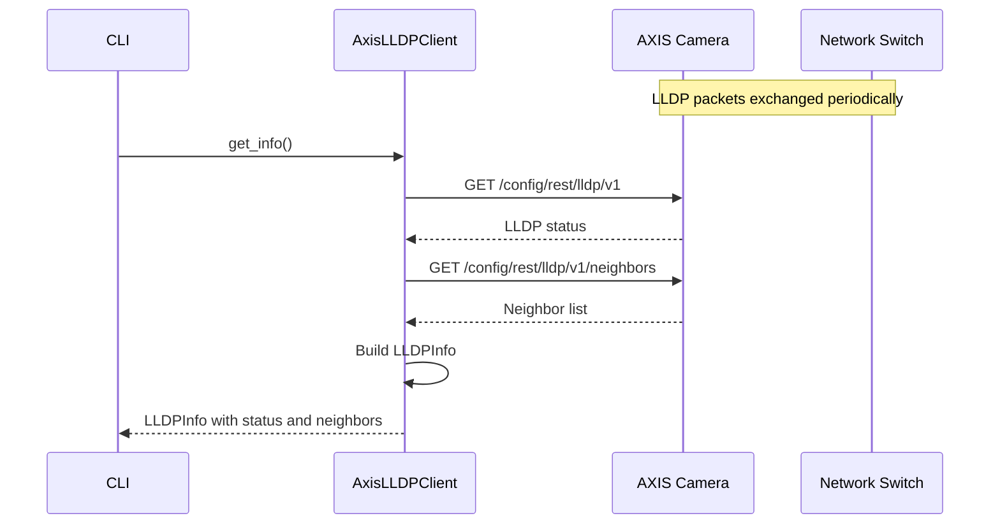
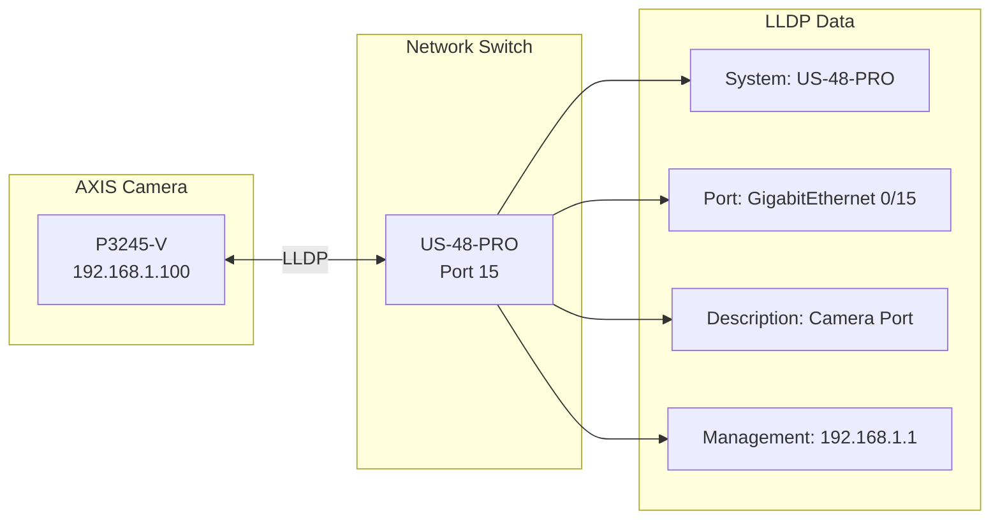

# axis_lldp.py - AXIS LLDP Discovery

> AXIS camera LLDP neighbor discovery via VAPIX REST API.

## Overview

This module provides `AxisLLDPClient` for retrieving Link Layer Discovery Protocol (LLDP) information from AXIS cameras. It uses the VAPIX `/config/rest/lldp/v1` endpoint to discover network neighbors, including connected switches and their port information.

## Architecture



## Class: AxisLLDPClient

### Initialization

```python
class AxisLLDPClient:
    """AXIS VAPIX LLDP API client."""

    def __init__(
        self,
        config: OnvifCameraConfig,
        timeout: float = 30.0,
    ) -> None:
        """Initialize LLDP client.

        Args:
            config: Camera configuration with credentials.
            timeout: HTTP request timeout in seconds.
        """
```

### Methods

| Method | Returns | Description |
|--------|---------|-------------|
| `get_status()` | `LLDPStatus` | Get LLDP status and settings |
| `get_neighbors()` | `list[LLDPNeighbor]` | Get discovered neighbors |
| `get_info()` | `LLDPInfo` | Get combined status and neighbors |

## Data Models

### LLDPStatus

```python
@dataclass
class LLDPStatus:
    """LLDP configuration status."""

    enabled: bool
    chassis_id: str
    system_name: str
    system_description: str
    port_id: str
    management_address: str
```

### LLDPNeighbor

```python
@dataclass
class LLDPNeighbor:
    """Discovered LLDP neighbor."""

    chassis_id: str
    port_id: str
    port_description: str
    system_name: str
    system_description: str
    management_address: str
    capabilities: list[str]
```

### LLDPInfo

```python
@dataclass
class LLDPInfo:
    """Combined LLDP information."""

    status: LLDPStatus
    neighbors: list[LLDPNeighbor]
    camera_name: str
    camera_address: str
    retrieved_at: str
```

## LLDP Discovery Flow



## Network Discovery Visualization



## Usage Example

```python
from unifi_camera_manager.axis_lldp import AxisLLDPClient
from unifi_camera_manager.config import OnvifCameraConfig

async def main():
    config = OnvifCameraConfig(
        ip_address="192.168.1.100",
        username="admin",
        password="password",
    )

    async with AxisLLDPClient(config) as client:
        # Get LLDP status
        status = await client.get_status()
        print(f"LLDP Enabled: {status.enabled}")
        print(f"System Name: {status.system_name}")

        # Get discovered neighbors
        neighbors = await client.get_neighbors()
        for neighbor in neighbors:
            print(f"Switch: {neighbor.system_name}")
            print(f"Port: {neighbor.port_description}")
            print(f"Management IP: {neighbor.management_address}")

        # Get combined info
        info = await client.get_info()
        print(f"Camera: {info.camera_name}")
        print(f"Neighbors found: {len(info.neighbors)}")
```

## CLI Integration

```bash
# Get LLDP neighbor information
uv run ucam axis lldp --camera "Front Door"

# Output example:
# LLDP Information for Front Door (192.168.1.100)
#
# Status:
#   Enabled: Yes
#   System Name: axis-accc8e123456
#   Chassis ID: AC:CC:8E:12:34:56
#
# Neighbors:
#   Switch: US-48-PRO
#   Port: GigabitEthernet 0/15
#   Description: Camera Port - Front Door
#   Management: 192.168.1.1
#   Capabilities: Bridge, Router
```

## Use Cases

### Network Documentation

Automatically discover which switch port each camera is connected to:

```python
async def document_camera_ports(cameras: list[OnvifCameraConfig]):
    """Generate network documentation for cameras."""
    for config in cameras:
        async with AxisLLDPClient(config) as client:
            info = await client.get_info()
            for neighbor in info.neighbors:
                print(f"Camera {config.name} -> "
                      f"{neighbor.system_name} port {neighbor.port_id}")
```

### Network Troubleshooting

Verify camera network connectivity and switch configuration:

```python
async def verify_network_path(config: OnvifCameraConfig):
    """Verify camera's network path."""
    async with AxisLLDPClient(config) as client:
        info = await client.get_info()

        if not info.status.enabled:
            print("⚠️ LLDP is disabled on camera")
            return

        if not info.neighbors:
            print("⚠️ No LLDP neighbors discovered")
            return

        for neighbor in info.neighbors:
            print(f"✅ Connected to {neighbor.system_name}")
            print(f"   Port: {neighbor.port_description}")
```

## Response Parsing

### Status Response

```json
{
  "enabled": true,
  "chassisId": "AC:CC:8E:12:34:56",
  "systemName": "axis-accc8e123456",
  "systemDescription": "AXIS P3245-V Network Camera",
  "portId": "eth0",
  "managementAddress": "192.168.1.100"
}
```

### Neighbors Response

```json
{
  "neighbors": [
    {
      "chassisId": "78:45:58:AB:CD:EF",
      "portId": "0/15",
      "portDescription": "GigabitEthernet 0/15",
      "systemName": "US-48-PRO",
      "systemDescription": "UniFi Switch 48 PRO",
      "managementAddress": "192.168.1.1",
      "capabilities": ["bridge", "router"]
    }
  ]
}
```

## Error Handling

```python
async def get_neighbors(self) -> list[LLDPNeighbor]:
    """Get LLDP neighbors with error handling."""
    try:
        response = await client.get(url)
        response.raise_for_status()
        data = response.json()
        return [LLDPNeighbor(**n) for n in data.get("neighbors", [])]
    except httpx.HTTPStatusError as e:
        if e.response.status_code == 401:
            raise AuthenticationError("Invalid credentials")
        if e.response.status_code == 404:
            raise NotFoundError("LLDP API not available")
        raise
```

## Dependencies

- **httpx**: Async HTTP client with Digest auth
- **dataclasses**: Data models for LLDP information
