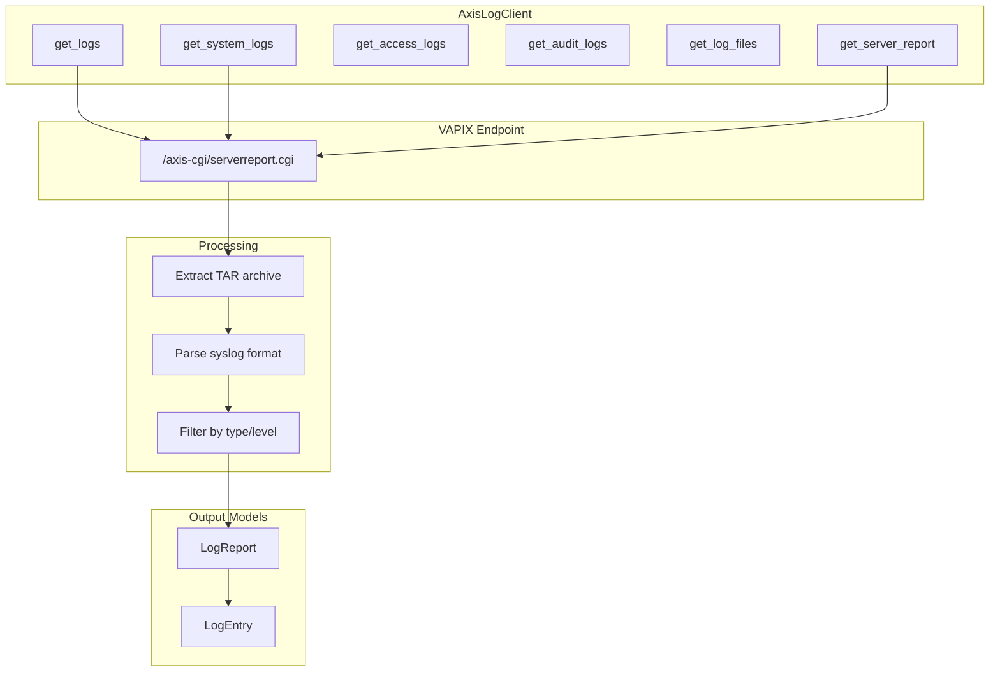
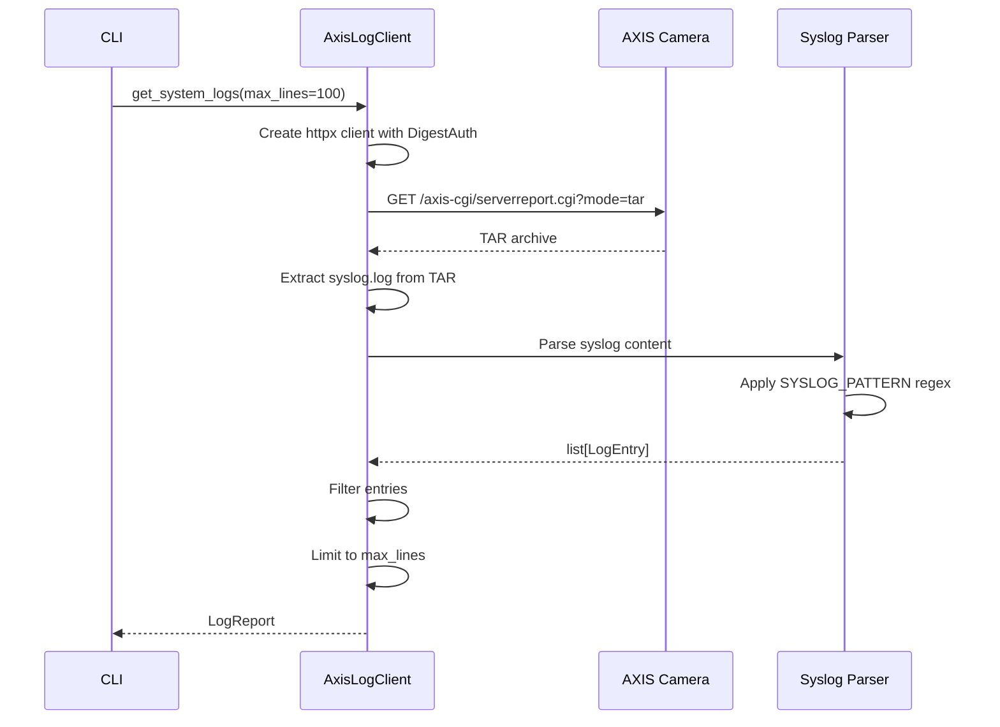
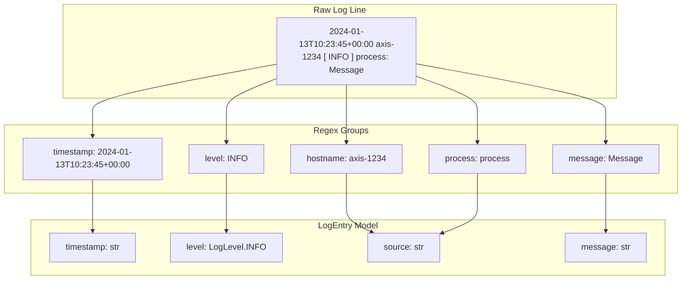

# axis_logs.py - AXIS Log Retrieval

> AXIS camera log retrieval via VAPIX serverreport.cgi API.

## Overview

This module provides `AxisLogClient` for retrieving system, access, and audit logs from AXIS cameras. It uses the VAPIX `/axis-cgi/serverreport.cgi` endpoint to download TAR archives containing log files, then parses the syslog format.

## Architecture



## Class: AxisLogClient

### Initialization

```python
class AxisLogClient:
    """AXIS VAPIX log retrieval client."""

    def __init__(
        self,
        config: OnvifCameraConfig,
        timeout: float = 30.0,
    ) -> None:
        """Initialize log client.

        Args:
            config: Camera configuration with credentials.
            timeout: HTTP request timeout in seconds.
        """
        self._config = config
        self._timeout = timeout
        self._client: httpx.AsyncClient | None = None
```

### Methods

| Method | Returns | Description |
|--------|---------|-------------|
| `get_logs()` | `LogReport` | Get logs by type |
| `get_system_logs()` | `LogReport` | Get system/syslog entries |
| `get_access_logs()` | `LogReport` | Get access control logs |
| `get_audit_logs()` | `LogReport` | Get security audit logs |
| `get_log_files()` | `list[str]` | List available log files |
| `get_server_report()` | `bytes` | Download raw server report |

## Log Retrieval Flow



## Syslog Parsing

### SYSLOG_PATTERN Regex

```python
SYSLOG_PATTERN = re.compile(
    r"^(?P<timestamp>\d{4}-\d{2}-\d{2}T\d{2}:\d{2}:\d{2}"
    r"(?:\.\d+)?(?:[+-]\d{2}:\d{2})?)\s+"
    r"(?P<hostname>\S+)\s+"
    r"\[\s*(?P<level>\w+)\s*\]\s+"
    r"(?P<process>\S+):\s+"
    r"(?P<message>.*)$"
)
```

### Log Entry Parsing Flow



### Level Detection

```python
def _detect_log_level(level_str: str, message: str) -> LogLevel:
    """Detect log level from level string or message content.

    Priority:
    1. Explicit level string (INFO, WARNING, ERROR, etc.)
    2. Keywords in message (error, warning, failed, etc.)
    3. Default to INFO
    """
    level_str = level_str.upper()

    if level_str in ("CRIT", "CRITICAL", "FATAL"):
        return LogLevel.CRITICAL
    if level_str in ("ERR", "ERROR"):
        return LogLevel.ERROR
    if level_str in ("WARN", "WARNING"):
        return LogLevel.WARNING
    if level_str in ("DEBUG", "TRACE"):
        return LogLevel.DEBUG

    # Check message content for level indicators
    msg_lower = message.lower()
    if any(kw in msg_lower for kw in ("error", "failed", "failure")):
        return LogLevel.ERROR
    if any(kw in msg_lower for kw in ("warning", "warn")):
        return LogLevel.WARNING

    return LogLevel.INFO
```

## VAPIX Server Report Modes

| Mode | Description | Content |
|------|-------------|---------|
| `tar` | TAR archive with all logs | Multiple log files |
| `tar_all` | Extended TAR archive | Logs + config files |
| `text` | Plain text report | Summary information |

```python
class ServerReportMode(str, Enum):
    """VAPIX server report modes."""

    TAR = "tar"
    TAR_ALL = "tar_all"
    TEXT = "text"
```

## Authentication

Uses HTTP Digest authentication:

```python
async def _get_client(self) -> httpx.AsyncClient:
    """Get or create authenticated HTTP client."""
    if self._client is None:
        username, password = self._config.get_axis_credentials()
        self._client = httpx.AsyncClient(
            auth=httpx.DigestAuth(username, password),
            timeout=self._timeout,
            verify=False,  # AXIS cameras use self-signed certs
        )
    return self._client
```

## Context Manager

```python
@asynccontextmanager
async def get_log_client(config: OnvifCameraConfig) -> AsyncIterator[AxisLogClient]:
    """Async context manager for log retrieval.

    Example:
        >>> async with get_log_client(config) as client:
        ...     logs = await client.get_system_logs(max_lines=50)
    """
    client = AxisLogClient(config)
    try:
        yield client
    finally:
        await client.close()
```

## Convenience Function

```python
async def get_camera_logs(
    config: OnvifCameraConfig,
    log_type: LogType = LogType.SYSTEM,
    max_lines: int | None = None,
    level: LogLevel | None = None,
) -> LogReport:
    """Convenience function for quick log retrieval.

    Args:
        config: Camera configuration.
        log_type: Type of logs to retrieve.
        max_lines: Maximum entries to return.
        level: Filter by minimum log level.

    Returns:
        LogReport with filtered entries.
    """
```

## Usage Example

```python
from unifi_camera_manager.axis_logs import AxisLogClient, get_camera_logs
from unifi_camera_manager.config import OnvifCameraConfig
from unifi_camera_manager.models import LogType, LogLevel

async def main():
    config = OnvifCameraConfig(
        ip_address="192.168.1.100",
        username="admin",
        password="password",
    )

    # Using context manager
    async with AxisLogClient(config) as client:
        # Get system logs
        report = await client.get_system_logs(max_lines=100)
        for entry in report.entries:
            print(f"[{entry.level.value}] {entry.timestamp}: {entry.message}")

        # Get only errors
        report = await client.get_logs(
            log_type=LogType.SYSTEM,
            max_lines=50,
        )
        errors = [e for e in report.entries if e.level == LogLevel.ERROR]

    # Using convenience function
    report = await get_camera_logs(
        config,
        log_type=LogType.AUDIT,
        max_lines=20,
    )
```

## CLI Integration

```bash
# Get system logs
uv run ucam logs system --camera "Front Door"

# Limit entries
uv run ucam logs system --camera "Front Door" --lines 50

# Get audit logs
uv run ucam logs audit --camera "Front Door"

# List available log files
uv run ucam logs files --camera "Front Door"
```

## Error Handling

```python
async def get_logs(
    self,
    log_type: LogType = LogType.SYSTEM,
    max_lines: int | None = None,
) -> LogReport:
    """Get logs with error handling."""
    try:
        response = await client.get(url)
        response.raise_for_status()
        # ... process response
    except httpx.HTTPStatusError as e:
        if e.response.status_code == 401:
            raise AuthenticationError("Invalid credentials")
        raise
    except httpx.TimeoutException:
        raise TimeoutError(f"Request timed out after {self._timeout}s")
```

## Dependencies

- **httpx**: Async HTTP client with Digest auth
- **tarfile**: TAR archive extraction
- **re**: Regex parsing for syslog format
