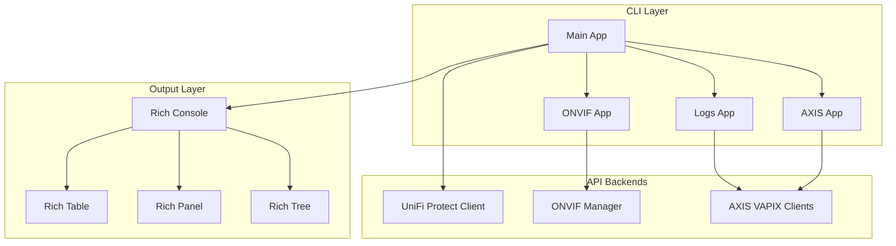
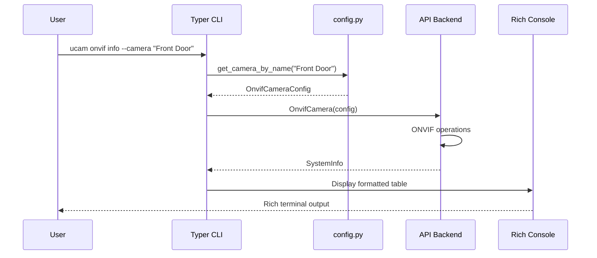

# cli.py - Command Line Interface

> Typer CLI application with 4 command groups and 27 commands for comprehensive camera management.

## Overview

The CLI module provides the main user interface for `ucam`, built with the [Typer](https://typer.tiangolo.com/) framework. It organizes commands into logical groups for UniFi Protect operations, ONVIF direct control, log retrieval, and AXIS configuration.

## Architecture



## Command Groups

### Main Commands (`ucam`)

| Command | Description | Backend |
|---------|-------------|---------|
| `list` | List all cameras from NVR | UniFi Protect |
| `info` | Get camera details by ID or IP | UniFi Protect |
| `find` | Find camera by IP address | UniFi Protect |
| `adopt` | Adopt an unadopted camera | UniFi Protect |
| `unadopt` | Remove a camera (with confirmation) | UniFi Protect |
| `reboot` | Reboot a camera | UniFi Protect |
| `verify-onvif` | Test ONVIF connectivity | ONVIF Discovery |

### ONVIF Commands (`ucam onvif`)

| Command | Description | ONVIF Service |
|---------|-------------|---------------|
| `list` | List configured cameras | Config |
| `info` | Get device information | Device Management |
| `streams` | Get RTSP stream URIs | Media |
| `profiles` | List video profiles | Media |
| `image` | Get/set image settings | Imaging |
| `ptz status` | Get PTZ position | PTZ |
| `ptz presets` | List PTZ presets | PTZ |
| `ptz move` | Move camera | PTZ |
| `services` | List ONVIF services | Device Management |
| `scopes` | Get device scopes | Device Management |
| `reboot` | Reboot via ONVIF | Device Management |

### Log Commands (`ucam logs`)

| Command | Description | Log Type |
|---------|-------------|----------|
| `system` | Get system/syslog entries | SYSTEM |
| `access` | Get access control logs | ACCESS |
| `audit` | Get security audit logs | AUDIT |
| `files` | List available log files | N/A |

### AXIS Commands (`ucam axis`)

| Command | Description | VAPIX Endpoint |
|---------|-------------|----------------|
| `config` | Get camera configuration | param/v2beta |
| `param` | Get/set individual parameters | param/v2beta |
| `info` | Get device information | param/v2beta |
| `lldp` | Get LLDP neighbor info | lldp/v1 |
| `diagnostics` | Run stream diagnostics | Multiple |

## Command Flow



## Key Components

### Application Structure

```python
# Main application
app = typer.Typer(help="UniFi Camera Manager CLI")

# Sub-applications
onvif_app = typer.Typer(help="ONVIF camera operations")
logs_app = typer.Typer(help="AXIS log retrieval")
axis_app = typer.Typer(help="AXIS camera configuration")

# Register sub-apps
app.add_typer(onvif_app, name="onvif")
app.add_typer(logs_app, name="logs")
app.add_typer(axis_app, name="axis")
```

### Camera Resolution Pattern

All commands that target cameras follow this resolution pattern:

```python
def resolve_camera(
    camera: str | None,
    ip: str | None,
    user: str | None,
    password: str | None,
) -> OnvifCameraConfig:
    """Resolve camera configuration from various inputs."""
    if camera:
        # Lookup by name in config.yaml
        return get_camera_by_name(camera)
    elif ip:
        # Check config.yaml first, then use defaults
        config = get_camera_by_ip(ip)
        if config:
            return config
        # Use default credentials from config.yaml or env vars
        defaults = get_default_credentials()
        return OnvifCameraConfig(
            ip_address=ip,
            username=user or defaults.username,
            password=password or defaults.password,
        )
```

### Shell Completions

Tab completion support for common arguments:

```python
def camera_name_completion(incomplete: str) -> list[str]:
    """Complete camera names from config.yaml."""
    names = list_camera_names()
    return [n for n in names if n.lower().startswith(incomplete.lower())]

def protect_camera_id_completion(incomplete: str) -> list[str]:
    """Complete camera IDs from cached NVR data."""
    # Uses protect_cameras.json cache
    ...
```

### Async Wrapper Pattern

CLI commands use `asyncio.run()` to execute async operations:

```python
@app.command()
def list_cameras(
    third_party: bool = False,
    include_unadopted: bool = False,
):
    """List cameras from UniFi Protect NVR."""
    asyncio.run(_list_cameras_async(third_party, include_unadopted))

async def _list_cameras_async(third_party: bool, include_unadopted: bool):
    config = ProtectConfig()
    async with get_protect_client(config) as client:
        cameras = await client.list_cameras(
            include_unadopted=include_unadopted,
            third_party_only=third_party,
        )
        display_cameras_table(cameras)
```

## Output Formatting

### Rich Console Integration

```python
console = Console()

def display_cameras_table(cameras: list[CameraInfo]) -> None:
    """Display cameras in a Rich table."""
    table = Table(title="Cameras")
    table.add_column("Name", style="cyan")
    table.add_column("IP Address")
    table.add_column("Model")
    table.add_column("State", style="green")

    for cam in cameras:
        table.add_row(cam.name, cam.ip_address, cam.model, cam.state)

    console.print(table)
```

### Panel Output for Details

```python
def display_camera_info(info: SystemInfo) -> None:
    """Display camera info in a Rich panel."""
    content = f"""
[bold]Manufacturer:[/] {info.manufacturer}
[bold]Model:[/] {info.model}
[bold]Firmware:[/] {info.firmware_version}
[bold]Serial:[/] {info.serial_number}
"""
    console.print(Panel(content, title="Camera Information"))
```

## Global Options

| Option | Type | Default | Description |
|--------|------|---------|-------------|
| `--help` | flag | - | Show help message |
| `--log-file` | Path | None | Enable file logging |
| `--log-level` | choice | INFO | Log level |

## Dependencies

- **typer**: CLI framework with automatic help generation
- **rich**: Terminal formatting (tables, panels, trees)
- **asyncio**: Async execution wrapper
- **httpx**: HTTP client for API calls

## Error Handling

Commands display user-friendly error messages:

```python
try:
    async with OnvifCamera(config) as camera:
        info = await camera.get_system_info()
except Exception as e:
    console.print(f"[red]Error:[/] {e}")
    raise typer.Exit(1)
```
