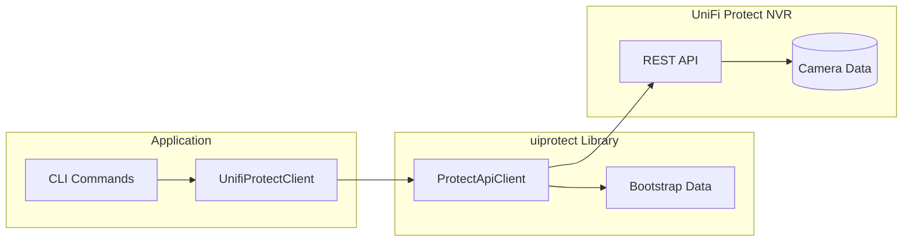
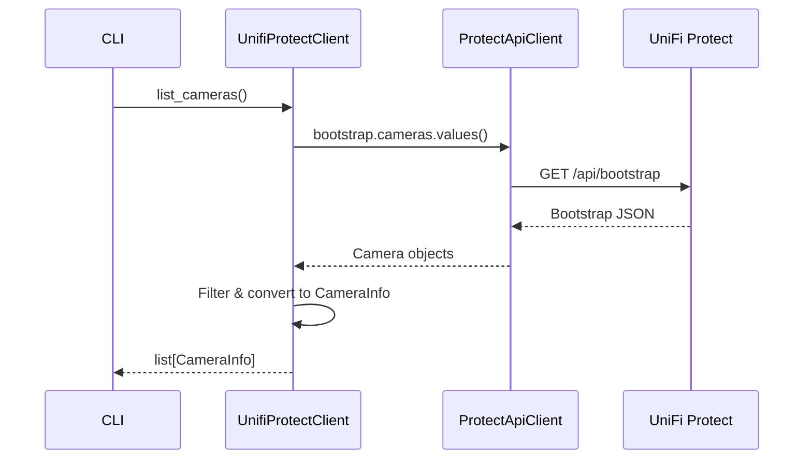
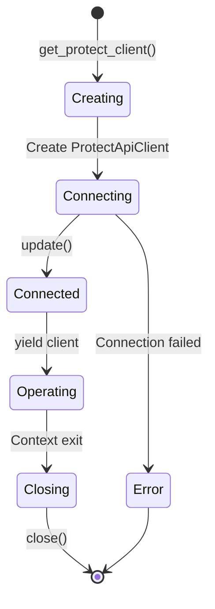

# client.py - UniFi Protect API Client

> Async wrapper for the UniFi Protect NVR API using the `uiprotect` library.

## Overview

This module provides `UnifiProtectClient`, a high-level async wrapper around the `uiprotect.ProtectApiClient` library. It handles authentication, connection management, and translates between the library's data structures and the application's Pydantic models.

## Architecture



## Class: UnifiProtectClient

### Initialization

```python
class UnifiProtectClient:
    """High-level UniFi Protect NVR API wrapper."""

    def __init__(self, api: ProtectApiClient) -> None:
        """Initialize with an authenticated ProtectApiClient instance."""
        self._api = api
```

### Methods

| Method | Returns | Description |
|--------|---------|-------------|
| `list_cameras()` | `list[CameraInfo]` | List all cameras with optional filters |
| `get_camera()` | `CameraInfo \| None` | Get camera by ID |
| `adopt_camera()` | `bool` | Adopt an unadopted camera |
| `unadopt_camera()` | `bool` | Remove camera from NVR |
| `reboot_camera()` | `bool` | Reboot camera |
| `get_nvr_info()` | `NvrInfo` | Get NVR system information |

### list_cameras()

```python
async def list_cameras(
    self,
    include_unadopted: bool = False,
    third_party_only: bool = False,
) -> list[CameraInfo]:
    """List cameras from the NVR.

    Args:
        include_unadopted: Include cameras not yet adopted.
        third_party_only: Filter to only third-party ONVIF cameras.

    Returns:
        List of CameraInfo models.
    """
```

### Data Flow



## Context Manager: get_protect_client()

The recommended way to use the client is via the async context manager:

```python
@asynccontextmanager
async def get_protect_client(
    config: ProtectConfig,
    include_unadopted: bool = True,
) -> AsyncIterator[UnifiProtectClient]:
    """Create and manage UniFi Protect client lifecycle.

    Args:
        config: ProtectConfig with NVR connection details.
        include_unadopted: Whether to fetch unadopted cameras.

    Yields:
        Authenticated UnifiProtectClient instance.

    Example:
        >>> async with get_protect_client(config) as client:
        ...     cameras = await client.list_cameras()
    """
```

### Connection Lifecycle



## Model Conversion

### to_camera_info()

Converts `uiprotect` Camera objects to application CameraInfo models:

```python
def to_camera_info(camera: Camera) -> CameraInfo:
    """Convert uiprotect Camera to CameraInfo model."""
    return CameraInfo(
        id=camera.id,
        name=camera.name,
        type=str(camera.type),
        state=str(camera.state),
        ip_address=camera.host,
        mac=camera.mac,
        firmware_version=camera.firmware_version,
        model=camera.model,
        is_adopted=camera.is_adopted,
        is_connected=camera.is_connected,
        is_third_party=getattr(camera, "is_third_party", False),
    )
```

### to_nvr_info()

Converts NVR bootstrap data to NvrInfo model:

```python
def to_nvr_info(nvr: NVR) -> NvrInfo:
    """Convert uiprotect NVR to NvrInfo model."""
    return NvrInfo(
        id=nvr.id,
        name=nvr.name,
        type=str(nvr.type),
        version=nvr.version,
        host=nvr.host,
        is_connected=True,
    )
```

## Configuration

### ProtectConfig

Connection configuration loaded from environment variables:

| Variable | Required | Default | Description |
|----------|----------|---------|-------------|
| `UFP_USERNAME` | Yes | - | NVR admin username |
| `UFP_PASSWORD` | Yes | - | NVR admin password |
| `UFP_ADDRESS` | Yes | - | NVR IP address |
| `UFP_PORT` | No | 443 | HTTPS port |
| `UFP_SSL_VERIFY` | No | false | Verify SSL certificates |

## Usage Example

```python
from unifi_camera_manager.client import get_protect_client
from unifi_camera_manager.config import ProtectConfig

async def main():
    config = ProtectConfig()  # Loads from environment

    async with get_protect_client(config) as client:
        # List all cameras
        cameras = await client.list_cameras()
        for cam in cameras:
            print(f"{cam.name}: {cam.ip_address}")

        # Get specific camera
        camera = await client.get_camera("camera_id_here")
        if camera:
            print(f"Found: {camera.name}")

        # Reboot camera
        success = await client.reboot_camera("camera_id_here")
        print(f"Reboot: {'Success' if success else 'Failed'}")
```

## Error Handling

The client wraps `uiprotect` exceptions with meaningful messages:

```python
async def adopt_camera(self, camera_id: str) -> bool:
    """Adopt a camera into UniFi Protect."""
    try:
        camera = self._api.bootstrap.cameras.get(camera_id)
        if camera is None:
            return False
        await camera.adopt()
        return True
    except Exception:
        return False
```

## Dependencies

- **uiprotect**: Official UniFi Protect Python library
- **aiohttp**: Async HTTP client (used by uiprotect)
- **pydantic**: Data validation for models
