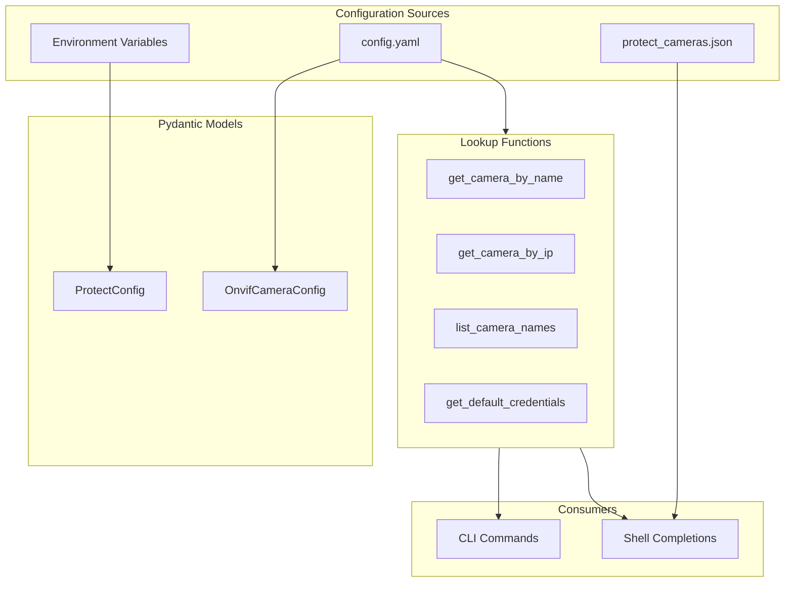

# config.py - Configuration Management

> XDG-compliant configuration with environment variable interpolation and camera lookups.

## Overview

This module handles all configuration aspects of the application:
- XDG-compliant paths for config and data files
- Environment variable loading for UniFi Protect connection
- YAML configuration file parsing with `${VAR}` interpolation
- Camera lookup by name or IP address
- Shell completion helpers

## Architecture



## XDG Paths

Using `platformdirs` for standard paths:

```python
from platformdirs import user_config_dir, user_data_dir

APP_NAME = "ucam"

def get_config_dir() -> Path:
    """Get XDG config directory (~/.config/ucam/)."""
    return Path(user_config_dir(APP_NAME))

def get_data_dir() -> Path:
    """Get XDG data directory (~/.local/share/ucam/)."""
    return Path(user_data_dir(APP_NAME))

def get_config_path() -> Path:
    """Get path to config.yaml."""
    # Check local directory first, then XDG path
    local = Path("config.yaml")
    if local.exists():
        return local
    return get_config_dir() / "config.yaml"
```

## ProtectConfig

UniFi Protect NVR connection settings loaded from environment:

```python
class ProtectConfig(BaseSettings):
    """UniFi Protect NVR connection settings.

    Loaded automatically from UFP_* environment variables.
    """

    model_config = SettingsConfigDict(
        env_prefix="UFP_",
        env_file=".env",
        extra="ignore",
    )

    username: str
    password: str
    address: str
    port: int = 443
    ssl_verify: bool = False
```

### Environment Variables

| Variable | Required | Default | Description |
|----------|----------|---------|-------------|
| `UFP_USERNAME` | Yes | - | NVR admin username |
| `UFP_PASSWORD` | Yes | - | NVR admin password |
| `UFP_ADDRESS` | Yes | - | NVR IP address |
| `UFP_PORT` | No | 443 | HTTPS port |
| `UFP_SSL_VERIFY` | No | false | Verify SSL certs |

## OnvifCameraConfig

Individual camera configuration from YAML:

```python
class OnvifCameraConfig(BaseModel):
    """ONVIF camera connection settings."""

    model_config = ConfigDict(frozen=True, populate_by_name=True)

    ip_address: str = Field(..., alias="address")
    username: str
    password: str
    port: int = 80
    name: str | None = None
    vendor: str | None = None
    model: str | None = None

    # AXIS-specific credentials for VAPIX APIs
    axis_username: str | None = None
    axis_password: str | None = None

    def get_axis_credentials(self) -> tuple[str, str]:
        """Get AXIS credentials, falling back to ONVIF credentials."""
        return (
            self.axis_username or self.username,
            self.axis_password or self.password,
        )
```

### Field Alias

The `ip_address` field accepts both `ip_address` and `address` in YAML:

```yaml
devices:
  - name: Front Door
    address: 192.168.1.100  # alias for ip_address
    # OR
    ip_address: 192.168.1.100
```

## Environment Variable Interpolation

The `${VAR}` syntax in config.yaml is replaced with environment values:

```python
def interpolate_env_vars(value: str) -> str:
    """Replace ${VAR} patterns with environment variable values.

    Example:
        "${MY_PASSWORD}" with MY_PASSWORD=secret → "secret"
    """
    pattern = re.compile(r"\$\{([^}]+)\}")

    def replace(match: re.Match) -> str:
        var_name = match.group(1)
        return os.environ.get(var_name, match.group(0))

    return pattern.sub(replace, value)
```

### Interpolation Flow

```mermaid
flowchart TB
    subgraph Input["config.yaml"]
        A1["password: '${AXIS_PASSWORD}'"]
    end

    subgraph Process["interpolate_env_vars()"]
        B1[Find ${VAR} patterns]
        B2[Lookup in os.environ]
        B3[Replace with values]
    end

    subgraph Output["Resolved Value"]
        C1["password: 'secret123'"]
    end

    A1 --> B1
    B1 --> B2
    B2 --> B3
    B3 --> C1
```

## Camera Lookup Functions

### get_camera_by_name()

```python
def get_camera_by_name(name: str) -> OnvifCameraConfig | None:
    """Get camera configuration by name.

    Args:
        name: Camera name as defined in config.yaml.

    Returns:
        OnvifCameraConfig or None if not found.
    """
```

### get_camera_by_ip()

```python
def get_camera_by_ip(ip: str) -> OnvifCameraConfig | None:
    """Get camera configuration by IP address.

    Args:
        ip: Camera IP address.

    Returns:
        OnvifCameraConfig or None if not found.
    """
```

### get_default_credentials()

```python
def get_default_credentials() -> OnvifCameraConfig:
    """Get default credentials from config.yaml defaults section.

    Used when --ip is specified without explicit credentials.
    """
```

### list_camera_names()

```python
def list_camera_names() -> list[str]:
    """Get list of all camera names for shell completion."""
```

## Config File Schema

```yaml
# Default credentials (used with --ip mode)
defaults:
  username: "${AXIS_ADMIN_USERNAME}"
  password: "${AXIS_ADMIN_PASSWORD}"
  port: 80

# Device definitions
devices:
  - name: Front Door
    address: 192.168.1.100
    username: "${AXIS_ADMIN_USERNAME}"
    password: "${AXIS_ADMIN_PASSWORD}"
    port: 80
    vendor: AXIS
    model: P3245-LV
    type: camera
    axis_username: "${AXIS_ADMIN_USERNAME}"
    axis_password: "${AXIS_ADMIN_PASSWORD}"

  - name: Back Yard
    address: 192.168.1.101
    username: onvif_user
    password: onvif_pass
    port: 80
    vendor: Generic
```

## Shell Completion Helpers

### camera_name_completion()

```python
def camera_name_completion(incomplete: str) -> list[str]:
    """Provide camera name completions for Typer.

    Args:
        incomplete: Partial input from user.

    Returns:
        List of matching camera names.
    """
    names = list_camera_names()
    return [n for n in names if n.lower().startswith(incomplete.lower())]
```

### protect_camera_id_completion()

```python
def protect_camera_id_completion(incomplete: str) -> list[str]:
    """Provide UniFi Protect camera ID completions.

    Reads from cached protect_cameras.json file.
    """
```

## Caching

### LRU Cache for Config Loading

```python
@lru_cache(maxsize=1)
def load_cameras_config() -> dict[str, Any]:
    """Load and cache config.yaml.

    Uses LRU cache to avoid repeated file reads.
    """
```

### Protect Cameras Cache

```python
def save_protect_cameras_cache(cameras: list[dict]) -> None:
    """Save camera list for shell completion.

    File: ~/.local/share/ucam/protect_cameras.json
    """

def load_protect_cameras_cache() -> list[dict]:
    """Load cached camera list for completions."""
```

## Usage Example

```python
from unifi_camera_manager.config import (
    ProtectConfig,
    get_camera_by_name,
    get_camera_by_ip,
    get_default_credentials,
)

# Load UniFi Protect config from environment
protect_config = ProtectConfig()
print(f"NVR: {protect_config.address}")

# Get camera by name
camera = get_camera_by_name("Front Door")
if camera:
    print(f"Camera IP: {camera.ip_address}")
    user, passwd = camera.get_axis_credentials()

# Get camera by IP (falls back to defaults)
camera = get_camera_by_ip("192.168.1.100")
if camera is None:
    defaults = get_default_credentials()
    # Use defaults.username, defaults.password
```

## Dependencies

- **pydantic**: Data validation (BaseModel, Field)
- **pydantic-settings**: Environment loading (BaseSettings)
- **platformdirs**: XDG path resolution
- **PyYAML**: YAML parsing
