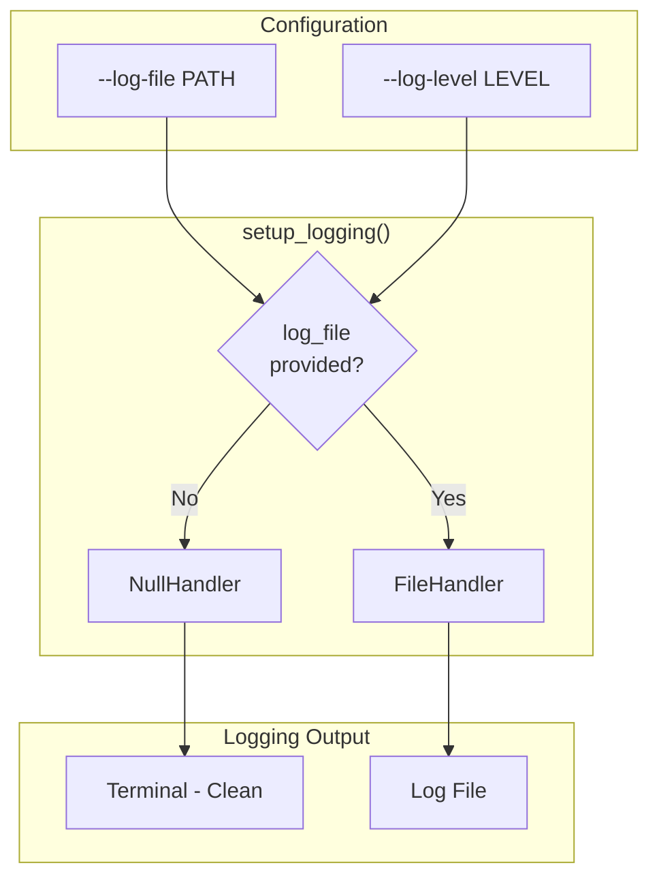
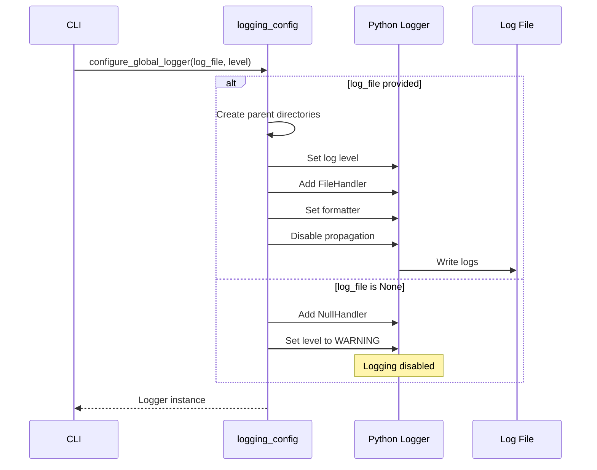

# logging_config.py - Logging Configuration

> File-based logging configuration for the CLI application.

## Overview

This module provides logging configuration for the `ucam` CLI. When enabled via `--log-file`, logs are written exclusively to the specified file (not stdout/stderr) to keep the terminal output clean for Rich-formatted displays.

## Architecture



## Functions

### setup_logging()

Main configuration function:

```python
def setup_logging(
    log_file: Path | str | None = None,
    log_level: str = "INFO",
    name: str = "ucam",
) -> logging.Logger:
    """Configure logging to file only (not stdout).

    Args:
        log_file: Path to log file. If None, logging is disabled.
        log_level: Log level (DEBUG, INFO, WARNING, ERROR, CRITICAL).
        name: Logger name.

    Returns:
        Configured logger instance.
    """
```

### get_logger()

Get existing logger by name:

```python
def get_logger(name: str = "ucam") -> logging.Logger:
    """Get existing logger by name.

    Returns logger instance (may be unconfigured if
    setup_logging not called).
    """
```

### configure_global_logger()

Configure the module-level global logger:

```python
def configure_global_logger(
    log_file: Path | str | None = None,
    log_level: str = "INFO",
) -> logging.Logger:
    """Configure the global logger instance.

    Used by CLI to set up logging once at startup.
    """
```

### Convenience Functions

Module-level logging helpers:

```python
def log_debug(message: str) -> None:
    """Log debug message if logging is configured."""

def log_info(message: str) -> None:
    """Log info message if logging is configured."""

def log_warning(message: str) -> None:
    """Log warning message if logging is configured."""

def log_error(message: str) -> None:
    """Log error message if logging is configured."""

def log_exception(message: str) -> None:
    """Log exception with traceback if logging is configured."""
```

## Configuration Flow



## Log Format

```python
formatter = logging.Formatter(
    fmt="%(asctime)s | %(levelname)-8s | %(name)s | %(message)s",
    datefmt="%Y-%m-%d %H:%M:%S",
)
```

**Example output:**
```
2024-01-13 10:23:45 | INFO     | ucam | Starting camera list operation
2024-01-13 10:23:46 | DEBUG    | ucam | Connected to NVR at 192.168.1.1
2024-01-13 10:23:46 | INFO     | ucam | Found 5 cameras
2024-01-13 10:23:47 | WARNING  | ucam | Camera Front_Door is offline
2024-01-13 10:23:48 | ERROR    | ucam | Failed to connect to Back_Yard: timeout
```

## Design Decisions

### File-Only Logging

Logs go only to file to preserve Rich terminal output:

```python
# Don't propagate to root logger (prevents stdout output)
logger.propagate = False
```

### Null Handler When Disabled

Prevents "No handler found" warnings:

```python
if log_file is None:
    logger.addHandler(logging.NullHandler())
    logger.setLevel(logging.WARNING)
```

### Parent Directory Creation

Automatically creates log directory:

```python
if isinstance(log_file, str):
    log_file = Path(log_file)
log_file.parent.mkdir(parents=True, exist_ok=True)
```

## Usage in CLI

### Global Options

```python
@app.callback()
def main(
    log_file: Annotated[
        Path | None,
        typer.Option(help="Log file path"),
    ] = None,
    log_level: Annotated[
        str,
        typer.Option(help="Log level"),
    ] = "INFO",
):
    """Configure logging for CLI session."""
    configure_global_logger(log_file, log_level)
```

### In Command Functions

```python
@app.command()
def list_cameras():
    """List all cameras."""
    log_info("Starting camera list operation")
    try:
        # ... operation
        log_debug(f"Found {len(cameras)} cameras")
    except Exception as e:
        log_error(f"Failed to list cameras: {e}")
        raise
```

## Usage Example

```python
from unifi_camera_manager.logging_config import (
    configure_global_logger,
    log_info,
    log_error,
    log_debug,
)

# Configure at startup
logger = configure_global_logger(
    log_file="/tmp/ucam.log",
    log_level="DEBUG",
)

# Use convenience functions
log_info("Application started")
log_debug("Debug information")

try:
    # ... some operation
    pass
except Exception as e:
    log_error(f"Operation failed: {e}")
```

## CLI Examples

```bash
# Enable logging to file
uv run ucam list --log-file /tmp/ucam.log

# Enable debug logging
uv run ucam list --log-file /tmp/ucam.log --log-level DEBUG

# View logs in real-time
tail -f /tmp/ucam.log

# No logging (default)
uv run ucam list
```

## Integration Points

### With Rich Output

Logging to file keeps terminal clean for Rich:

```python
# Terminal shows Rich table
console.print(table)

# File receives debug info
log_debug(f"Rendered table with {len(cameras)} rows")
```

### With Async Operations

Log async operation lifecycle:

```python
async def list_cameras():
    log_info("Starting async camera list")
    async with get_protect_client(config) as client:
        log_debug("Connected to NVR")
        cameras = await client.list_cameras()
        log_info(f"Retrieved {len(cameras)} cameras")
    return cameras
```

## Dependencies

- **logging**: Python standard library logging
- **pathlib**: Path handling for log files
