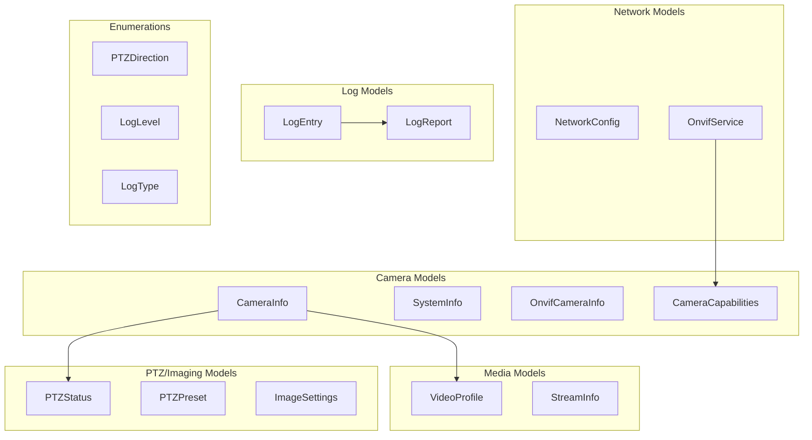

# models.py - Pydantic Data Models

> Type-safe data models with validation for all API entities.

## Overview

This module defines all Pydantic models used throughout the application. Models are organized by domain: camera information, ONVIF data, PTZ/imaging, network, logs, and NVR.

## Architecture



## Enumerations

### PTZDirection

```python
class PTZDirection(str, Enum):
    """PTZ movement directions."""

    UP = "up"
    DOWN = "down"
    LEFT = "left"
    RIGHT = "right"
    ZOOM_IN = "zoom-in"
    ZOOM_OUT = "zoom-out"
```

### LogLevel

```python
class LogLevel(str, Enum):
    """Syslog severity levels."""

    DEBUG = "debug"
    INFO = "info"
    WARNING = "warning"
    ERROR = "error"
    CRITICAL = "critical"
```

### LogType

```python
class LogType(str, Enum):
    """AXIS log types."""

    SYSTEM = "system"
    ACCESS = "access"
    AUDIT = "audit"
    ALL = "all"
```

## Camera Models

### CameraInfo

Camera information from UniFi Protect NVR:

```python
class CameraInfo(BaseModel):
    """Camera information from UniFi Protect."""

    id: str
    name: str
    type: str
    state: str
    ip_address: str | None = None
    mac: str | None = None
    firmware_version: str | None = None
    model: str | None = None
    is_adopted: bool = False
    is_connected: bool = False
    is_third_party: bool = False
```

### SystemInfo

Extended system information from ONVIF:

```python
class SystemInfo(BaseModel):
    """Extended ONVIF device information."""

    manufacturer: str
    model: str
    firmware_version: str
    serial_number: str
    hardware_id: str
    onvif_version: str | None = None
```

### OnvifCameraInfo

ONVIF GetDeviceInformation response:

```python
class OnvifCameraInfo(BaseModel):
    """ONVIF GetDeviceInformation response."""

    manufacturer: str
    model: str
    firmware_version: str
    serial_number: str
    hardware_id: str
    is_accessible: bool = False
    error: str | None = None
```

### CameraCapabilities

Discovered camera capabilities:

```python
class CameraCapabilities(BaseModel):
    """Camera capability information."""

    has_ptz: bool = False
    has_audio: bool = False
    has_io: bool = False
    has_imaging: bool = False
    has_analytics: bool = False
    supported_profiles: list[str] = []
```

## Media Models

### VideoProfile

ONVIF video profile configuration:

```python
class VideoProfile(BaseModel):
    """ONVIF video profile settings."""

    token: str
    name: str
    encoding: str
    resolution_width: int
    resolution_height: int
    frame_rate: float
    bitrate: int | None = None
    quality: float | None = None
```

### StreamInfo

RTSP stream information:

```python
class StreamInfo(BaseModel):
    """ONVIF stream URI information."""

    profile_token: str
    uri: str
    transport: str
    is_multicast: bool = False
```

## PTZ/Imaging Models

### PTZStatus

Current PTZ position and state:

```python
class PTZStatus(BaseModel):
    """PTZ current status."""

    pan: float
    tilt: float
    zoom: float
    is_moving: bool = False
```

### PTZPreset

Saved PTZ preset position:

```python
class PTZPreset(BaseModel):
    """PTZ preset definition."""

    token: str
    name: str
    pan: float | None = None
    tilt: float | None = None
    zoom: float | None = None
```

### ImageSettings

Camera image settings with validation:

```python
class ImageSettings(BaseModel):
    """Camera image settings."""

    brightness: float = Field(ge=0.0, le=1.0)
    contrast: float = Field(ge=0.0, le=1.0)
    saturation: float = Field(ge=0.0, le=1.0)
    sharpness: float = Field(ge=0.0, le=1.0)
```

## Network Models

### NetworkConfig

Camera network configuration:

```python
class NetworkConfig(BaseModel):
    """Camera network configuration."""

    ip_address: str
    subnet_mask: str | None = None
    gateway: str | None = None
    dns_servers: list[str] = []
    dhcp_enabled: bool = False
    mac_address: str | None = None
```

### OnvifService

Discovered ONVIF service:

```python
class OnvifService(BaseModel):
    """ONVIF service information."""

    namespace: str
    xaddr: str
    version: str | None = None
```

## Log Models

### LogEntry

Single parsed log entry:

```python
class LogEntry(BaseModel):
    """Parsed syslog entry."""

    timestamp: str
    level: LogLevel
    source: str
    message: str
```

### LogReport

Collection of log entries with metadata:

```python
class LogReport(BaseModel):
    """Log retrieval report."""

    camera_name: str
    camera_address: str
    log_type: LogType
    entries: list[LogEntry]
    raw_content: str
    retrieved_at: str
```

## NVR Models

### NvrInfo

UniFi Protect NVR information:

```python
class NvrInfo(BaseModel):
    """UniFi Protect NVR information."""

    id: str
    name: str
    type: str
    version: str
    host: str
    is_connected: bool = True
```

## Model Configuration

All models use Pydantic v2 configuration:

```python
class OnvifCameraConfig(BaseModel):
    """Example of frozen model with field validation."""

    model_config = ConfigDict(
        frozen=True,           # Immutable after creation
        populate_by_name=True, # Accept field aliases
        extra="ignore",        # Ignore unknown fields
    )

    ip_address: str = Field(..., alias="address")
    port: int = Field(default=80, ge=1, le=65535)
```

## Validation Examples

### Range Validation

```python
class ImageSettings(BaseModel):
    brightness: float = Field(ge=0.0, le=1.0)
    # ge = greater than or equal
    # le = less than or equal
```

### Field Aliases

```python
class OnvifCameraConfig(BaseModel):
    ip_address: str = Field(..., alias="address")
    # Accepts both "ip_address" and "address" in input
```

### Optional Fields with Defaults

```python
class CameraInfo(BaseModel):
    ip_address: str | None = None
    is_adopted: bool = False
```

## Usage Example

```python
from unifi_camera_manager.models import (
    CameraInfo,
    VideoProfile,
    PTZDirection,
    ImageSettings,
)

# Create camera info
camera = CameraInfo(
    id="abc123",
    name="Front Door",
    type="camera",
    state="CONNECTED",
    ip_address="192.168.1.100",
)

# Create video profile
profile = VideoProfile(
    token="profile_1",
    name="Main Stream",
    encoding="H.264",
    resolution_width=1920,
    resolution_height=1080,
    frame_rate=30.0,
)

# Image settings with validation
settings = ImageSettings(
    brightness=0.5,
    contrast=0.6,
    saturation=0.5,
    sharpness=0.4,
)

# Invalid value raises ValidationError
try:
    bad_settings = ImageSettings(brightness=1.5)  # > 1.0
except ValidationError as e:
    print(f"Validation error: {e}")
```

## Dependencies

- **pydantic**: Data validation and serialization
