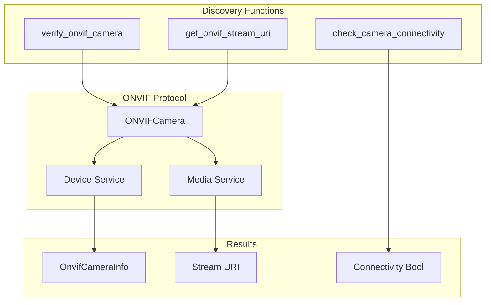
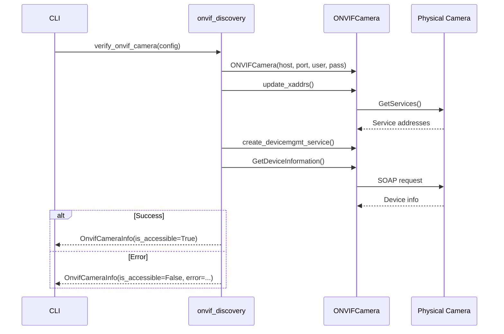
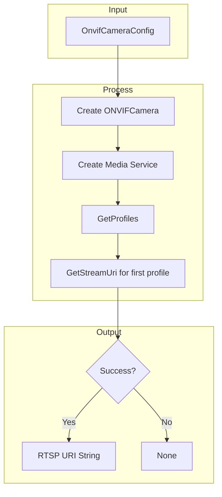

# onvif_discovery.py - ONVIF Discovery & Verification

> Functions for verifying ONVIF camera accessibility and network connectivity.

## Overview

This module provides lightweight functions for ONVIF camera discovery and verification. Unlike `onvif_manager.py` which provides full camera control, this module focuses on quick connectivity checks and basic information retrieval.

## Architecture



## Functions

### verify_onvif_camera()

Verify camera accessibility and retrieve basic device information:

```python
async def verify_onvif_camera(config: OnvifCameraConfig) -> OnvifCameraInfo:
    """Verify an ONVIF camera is accessible and retrieve its information.

    Args:
        config: ONVIF camera configuration with IP and credentials.

    Returns:
        OnvifCameraInfo with device details if accessible,
        or error information if connection failed.
    """
```

#### Verification Flow



#### Return Values

**Success case:**
```python
OnvifCameraInfo(
    manufacturer="AXIS",
    model="P3245-V",
    firmware_version="10.12.206",
    serial_number="ACCC8E123456",
    hardware_id="1234",
    is_accessible=True,
    error=None,
)
```

**Failure case:**
```python
OnvifCameraInfo(
    manufacturer="",
    model="",
    firmware_version="",
    serial_number="",
    hardware_id="",
    is_accessible=False,
    error="Connection refused",
)
```

### get_onvif_stream_uri()

Retrieve the RTSP stream URI from a camera:

```python
async def get_onvif_stream_uri(config: OnvifCameraConfig) -> str | None:
    """Get the RTSP stream URI from an ONVIF camera.

    Args:
        config: ONVIF camera configuration.

    Returns:
        RTSP stream URI string or None if unavailable.
    """
```

#### Stream URI Flow



### check_camera_connectivity()

Quick TCP connectivity check:

```python
async def check_camera_connectivity(
    ip_address: str,
    port: int = 80,
) -> bool:
    """Check if a camera is reachable on the network.

    Attempts TCP connection with 5-second timeout.

    Args:
        ip_address: Camera IP address to check.
        port: Port to check (default 80 for HTTP/ONVIF).

    Returns:
        True if camera is reachable, False otherwise.
    """
```

#### Connectivity Check Implementation

```python
async def check_camera_connectivity(ip_address: str, port: int = 80) -> bool:
    try:
        _, writer = await asyncio.wait_for(
            asyncio.open_connection(ip_address, port),
            timeout=5.0,
        )
        writer.close()
        await writer.wait_closed()
        return True
    except (TimeoutError, OSError):
        return False
```

## WSDL Directory

The module locates WSDL files from the installed `onvif` package:

```python
import onvif
from onvif import ONVIFCamera

# Get the correct WSDL path from the installed onvif package
WSDL_DIR = os.path.join(os.path.dirname(onvif.__file__), "wsdl")
```

## Usage Examples

### Verify Camera Before Adoption

```python
from unifi_camera_manager.onvif_discovery import verify_onvif_camera
from unifi_camera_manager.config import OnvifCameraConfig

async def check_camera(ip: str, user: str, password: str):
    config = OnvifCameraConfig(
        ip_address=ip,
        username=user,
        password=password,
    )

    info = await verify_onvif_camera(config)

    if info.is_accessible:
        print(f"✅ Found: {info.manufacturer} {info.model}")
        print(f"   Firmware: {info.firmware_version}")
        print(f"   Serial: {info.serial_number}")
    else:
        print(f"❌ Error: {info.error}")
```

### Quick Connectivity Check

```python
from unifi_camera_manager.onvif_discovery import check_camera_connectivity

async def scan_cameras(ip_list: list[str]):
    for ip in ip_list:
        is_online = await check_camera_connectivity(ip)
        status = "✅ Online" if is_online else "❌ Offline"
        print(f"{ip}: {status}")
```

### Get Stream URI

```python
from unifi_camera_manager.onvif_discovery import get_onvif_stream_uri

async def get_stream(config: OnvifCameraConfig):
    uri = await get_onvif_stream_uri(config)
    if uri:
        print(f"Stream: {uri}")
        # Use with ffmpeg, VLC, etc.
    else:
        print("Failed to get stream URI")
```

## CLI Integration

Used by the `verify-onvif` command:

```bash
# Verify ONVIF camera before adding to UniFi Protect
uv run ucam verify-onvif 192.168.1.100 -u admin -p password

# Output:
# ✅ ONVIF Camera Accessible
# Manufacturer: AXIS
# Model: P3245-V
# Firmware: 10.12.206
# Serial: ACCC8E123456
```

## Error Handling

All functions handle exceptions gracefully:

```python
async def verify_onvif_camera(config: OnvifCameraConfig) -> OnvifCameraInfo:
    try:
        # ... ONVIF operations
        return OnvifCameraInfo(is_accessible=True, ...)
    except Exception as e:
        return OnvifCameraInfo(
            manufacturer="",
            model="",
            # ... other empty fields
            is_accessible=False,
            error=str(e),
        )
```

## Dependencies

- **onvif-zeep-async**: ONVIF client library
- **asyncio**: Async I/O for connectivity checks
