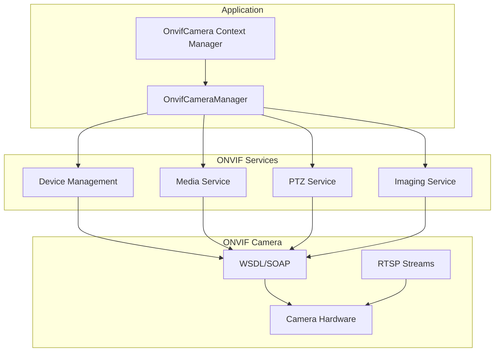
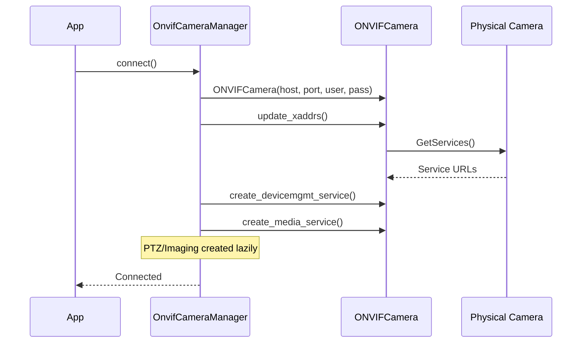
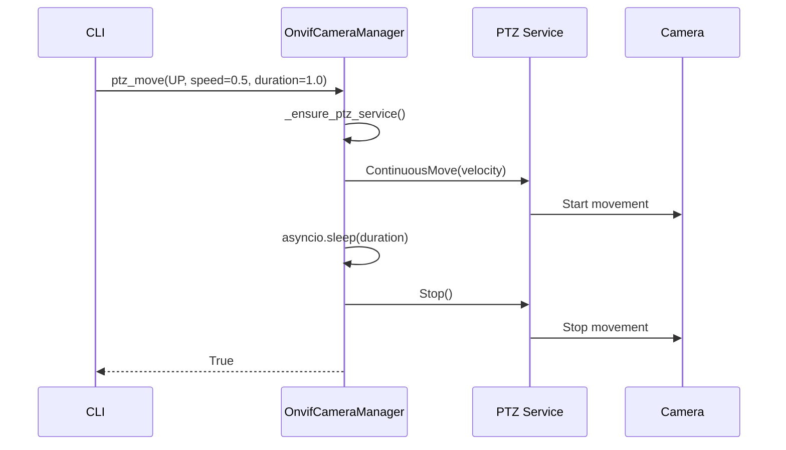
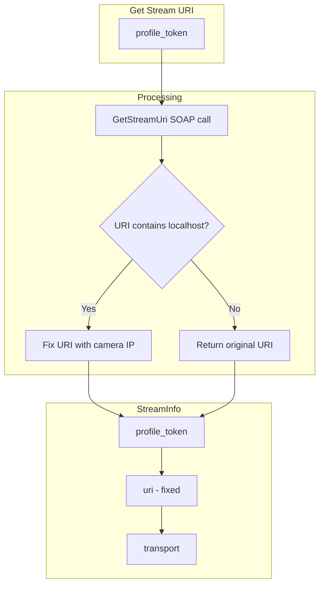

# onvif_manager.py - ONVIF Camera Manager

> Direct ONVIF camera communication for PTZ, profiles, streams, and image settings.

## Overview

This module provides `OnvifCameraManager`, a comprehensive async wrapper for ONVIF camera operations. It uses the `onvif-zeep-async` library to communicate directly with cameras via the ONVIF protocol, bypassing the UniFi Protect NVR.

## Architecture



## Class: OnvifCameraManager

### Initialization

```python
class OnvifCameraManager:
    """Manager for ONVIF camera operations."""

    def __init__(self, config: OnvifCameraConfig) -> None:
        """Initialize with camera configuration.

        Args:
            config: OnvifCameraConfig with IP, credentials, and port.
        """
        self._config = config
        self._camera: ONVIFCamera | None = None
        self._device_service = None
        self._media_service = None
        self._ptz_service = None
        self._imaging_service = None
```

### Service Initialization Flow



## Methods Reference

### Device Operations

| Method | Returns | Description |
|--------|---------|-------------|
| `connect()` | `None` | Initialize connection and services |
| `disconnect()` | `None` | Close connection |
| `get_system_info()` | `SystemInfo` | Get device information |
| `get_capabilities()` | `CameraCapabilities` | Get camera capabilities |
| `reboot()` | `None` | Reboot the camera |

### Media Operations

| Method | Returns | Description |
|--------|---------|-------------|
| `get_profiles()` | `list[VideoProfile]` | Get video profiles |
| `get_stream_uri()` | `StreamInfo` | Get RTSP stream URI |
| `get_all_stream_uris()` | `list[StreamInfo]` | Get all stream URIs |
| `get_services()` | `list[OnvifService]` | List ONVIF services |
| `get_scopes()` | `list[str]` | Get device scopes |

### PTZ Operations

| Method | Returns | Description |
|--------|---------|-------------|
| `get_ptz_status()` | `PTZStatus` | Get current PTZ position |
| `get_ptz_presets()` | `list[PTZPreset]` | List PTZ presets |
| `ptz_move()` | `bool` | Move camera in direction |
| `ptz_go_to_preset()` | `bool` | Go to saved preset |
| `ptz_stop()` | `None` | Stop PTZ movement |

### Imaging Operations

| Method | Returns | Description |
|--------|---------|-------------|
| `get_image_settings()` | `ImageSettings \| None` | Get current settings |
| `set_brightness()` | `bool` | Set brightness (0.0-1.0) |
| `set_contrast()` | `bool` | Set contrast (0.0-1.0) |
| `set_saturation()` | `bool` | Set saturation (0.0-1.0) |
| `set_sharpness()` | `bool` | Set sharpness (0.0-1.0) |

## PTZ Control

### Movement Pattern



### Direction Mapping

```python
async def ptz_move(
    self,
    direction: PTZDirection,
    speed: float = 0.5,
    duration: float = 0.5,
) -> bool:
    """Move camera in specified direction.

    Direction mapping:
    - UP: Pan=0, Tilt=+speed
    - DOWN: Pan=0, Tilt=-speed
    - LEFT: Pan=-speed, Tilt=0
    - RIGHT: Pan=+speed, Tilt=0
    - ZOOM_IN: Zoom=+speed
    - ZOOM_OUT: Zoom=-speed
    """
```

## Stream URI Handling

### Localhost Fixup

AXIS cameras sometimes return localhost/127.0.0.1 URIs. The manager automatically fixes these:

```python
def _fix_stream_uri(self, uri: str) -> str:
    """Fix localhost URIs returned by some cameras.

    Replaces 127.0.0.1 or localhost with the camera's actual IP.
    """
    if "127.0.0.1" in uri or "localhost" in uri:
        uri = uri.replace("127.0.0.1", self._config.ip_address)
        uri = uri.replace("localhost", self._config.ip_address)
    return uri
```

### Stream URI Flow



## Context Manager: OnvifCamera

The recommended usage pattern:

```python
@asynccontextmanager
async def OnvifCamera(config: OnvifCameraConfig) -> AsyncIterator[OnvifCameraManager]:
    """Async context manager for ONVIF camera operations.

    Args:
        config: Camera configuration.

    Yields:
        Connected OnvifCameraManager instance.

    Example:
        >>> async with OnvifCamera(config) as camera:
        ...     info = await camera.get_system_info()
        ...     print(f"Model: {info.model}")
    """
    manager = OnvifCameraManager(config)
    try:
        await manager.connect()
        yield manager
    finally:
        await manager.disconnect()
```

## Lazy Service Initialization

PTZ and Imaging services are created only when needed:

```python
async def _ensure_ptz_service(self) -> bool:
    """Lazily initialize PTZ service.

    Returns False if camera doesn't support PTZ.
    """
    if self._ptz_service is not None:
        return True
    try:
        self._ptz_service = await self._camera.create_ptz_service()
        return True
    except Exception:
        return False

async def _ensure_imaging_service(self) -> bool:
    """Lazily initialize Imaging service.

    Returns False if camera doesn't support imaging control.
    """
    if self._imaging_service is not None:
        return True
    try:
        self._imaging_service = await self._camera.create_imaging_service()
        return True
    except Exception:
        return False
```

## Usage Example

```python
from unifi_camera_manager.onvif_manager import OnvifCamera
from unifi_camera_manager.config import OnvifCameraConfig
from unifi_camera_manager.models import PTZDirection

async def main():
    config = OnvifCameraConfig(
        ip_address="192.168.1.100",
        username="admin",
        password="password",
        port=80,
    )

    async with OnvifCamera(config) as camera:
        # Get device info
        info = await camera.get_system_info()
        print(f"Camera: {info.manufacturer} {info.model}")

        # Get streams
        streams = await camera.get_all_stream_uris()
        for stream in streams:
            print(f"Stream: {stream.uri}")

        # PTZ control
        status = await camera.get_ptz_status()
        print(f"Position: Pan={status.pan}, Tilt={status.tilt}")

        await camera.ptz_move(PTZDirection.UP, speed=0.3, duration=1.0)

        # Image settings
        settings = await camera.get_image_settings()
        if settings:
            print(f"Brightness: {settings.brightness}")
```

## Error Handling

Methods return `None` or `False` when operations fail:

```python
async def get_image_settings(
    self,
    video_source_token: str | None = None,
) -> ImageSettings | None:
    """Get current image settings.

    Returns None if imaging service unavailable.
    """
    if not await self._ensure_imaging_service():
        return None
    # ... implementation
```

## Dependencies

- **onvif-zeep-async**: Async ONVIF client library
- **zeep**: SOAP/WSDL client
- **asyncio**: Async I/O support
