# Core Workflows

This document describes the core operational workflows in UniFi Camera Manager, including data flows, process sequences, and integration patterns.

## Camera Discovery and Adoption

### Workflow: Adding a Third-Party ONVIF Camera to UniFi Protect

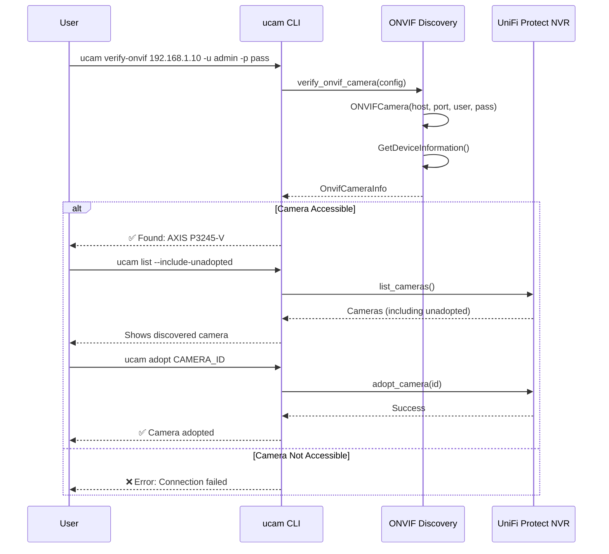

### Workflow: Configuration Resolution

When a CLI command is executed, the configuration is resolved through multiple sources:

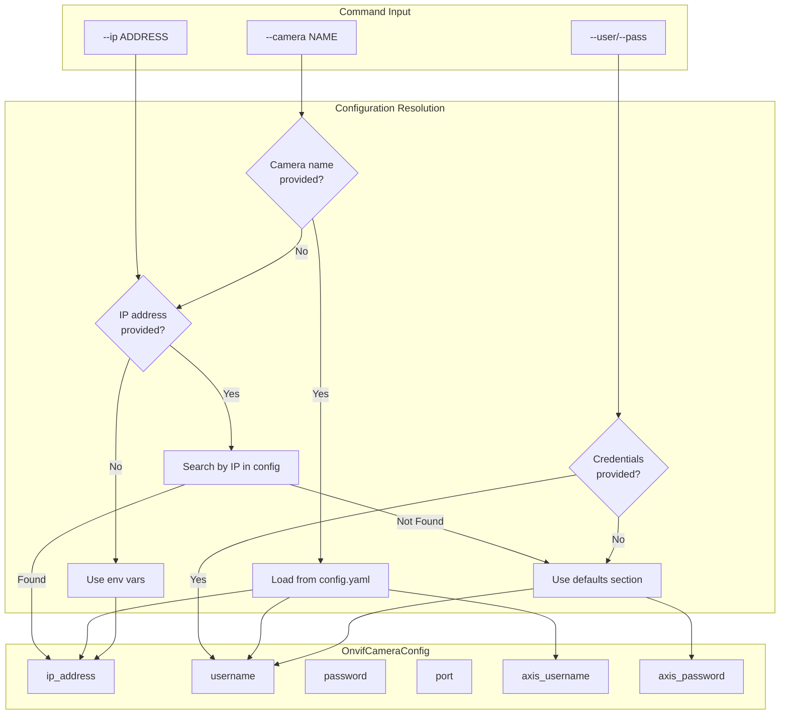

## Log Retrieval Workflow

### Workflow: Retrieving AXIS System Logs

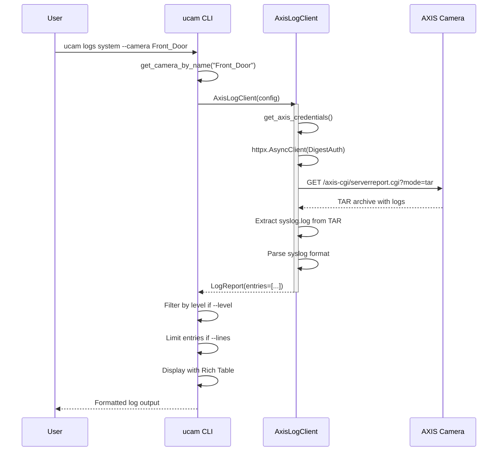

### Syslog Parsing Process

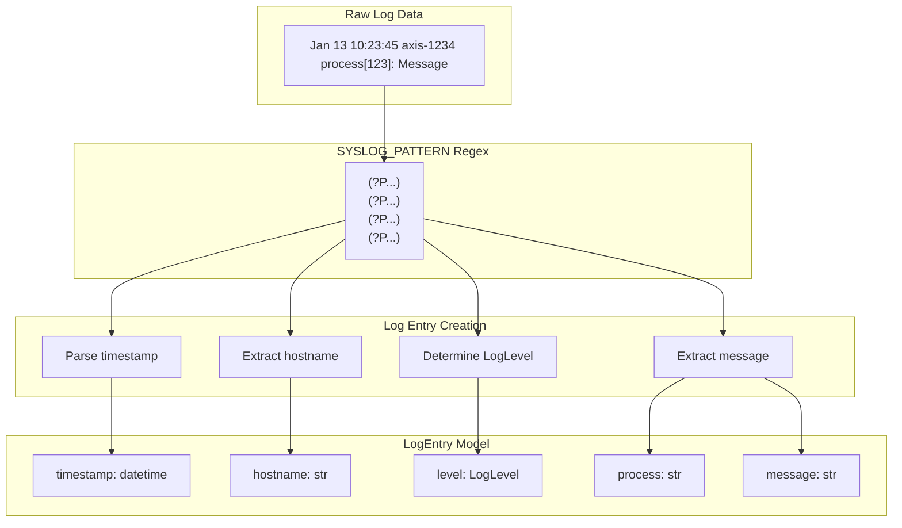

## ONVIF Operations Workflow

### Workflow: PTZ Control

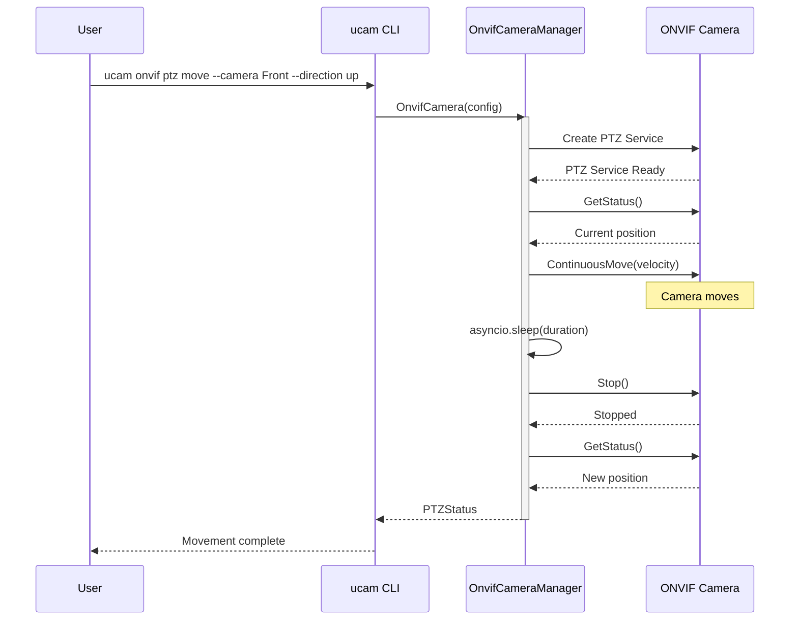

### Workflow: Retrieving Stream URIs

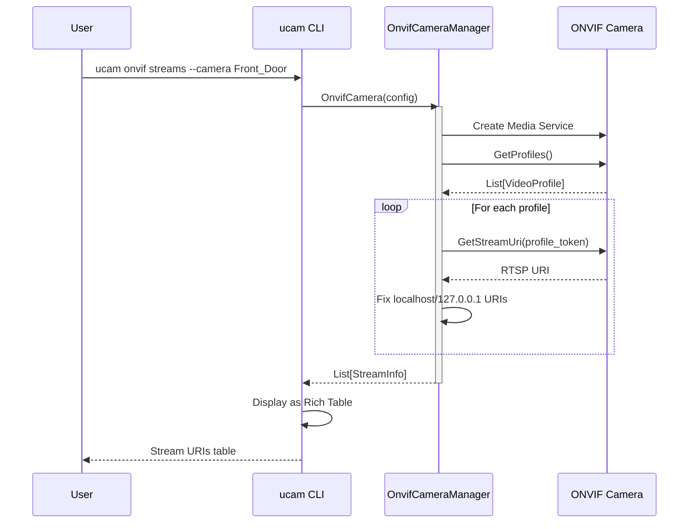

## AXIS VAPIX Operations

### Workflow: LLDP Neighbor Discovery

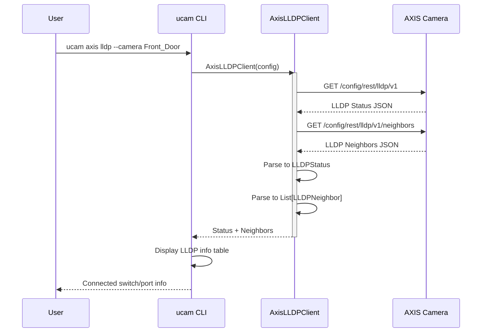

### Workflow: Stream Diagnostics

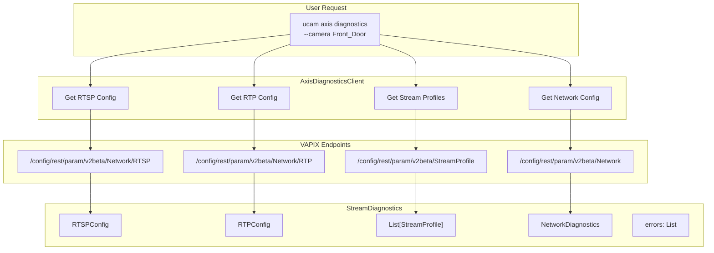

## Error Handling Workflows

### Workflow: Authentication Error Recovery

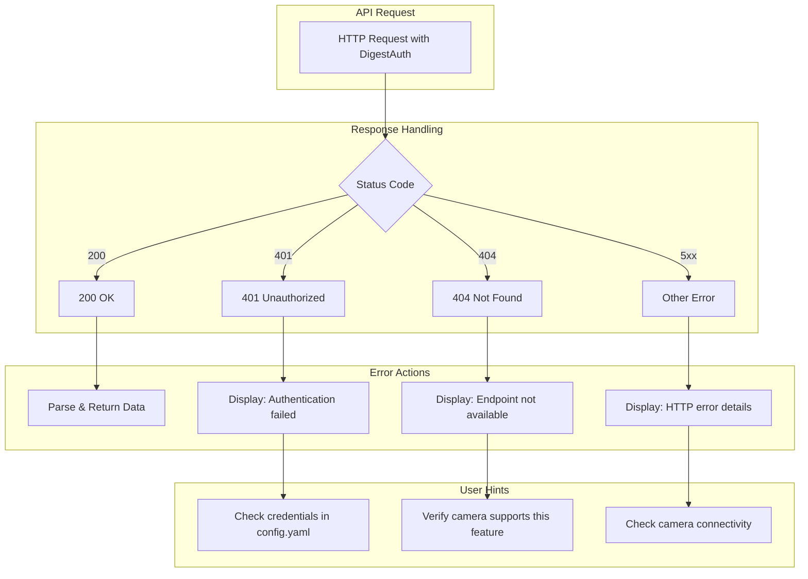

### Workflow: Graceful Degradation in Diagnostics

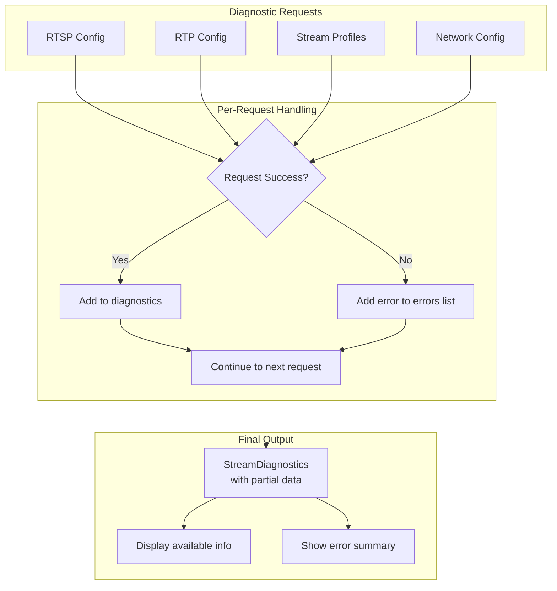

## Shell Completion Workflow

### Workflow: Camera Name Completion

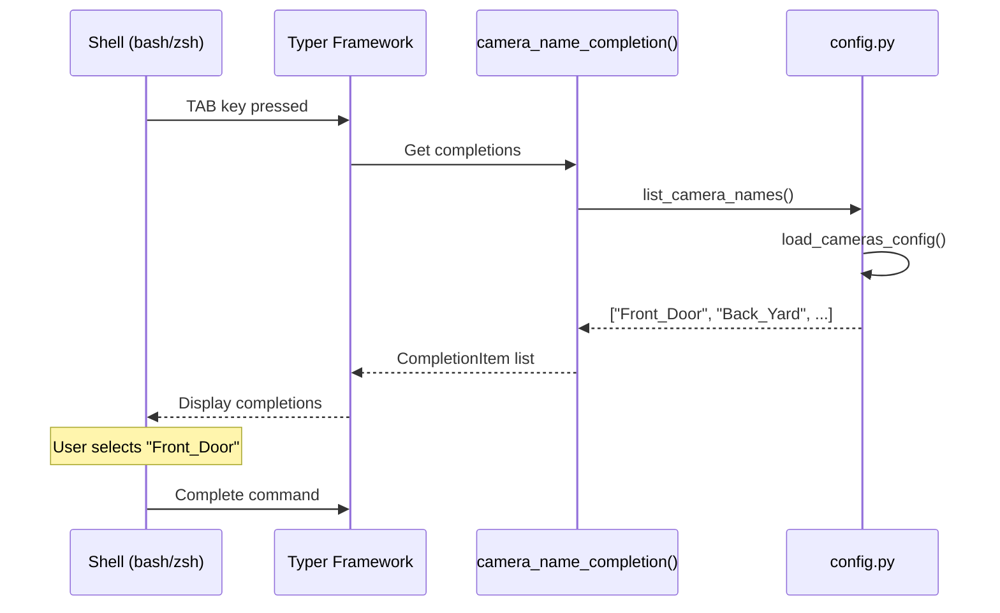

### Workflow: Protect Camera ID Completion

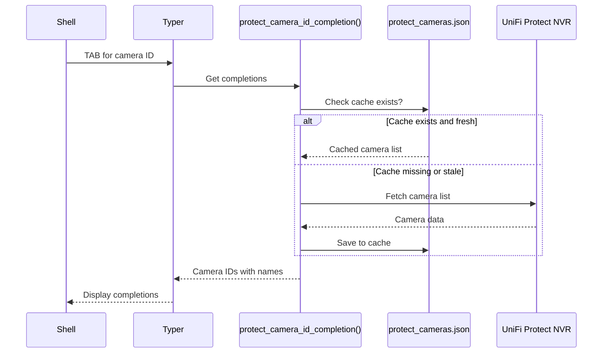

## Data Transformation Flows

### Flow: UniFi Protect Camera to CameraInfo

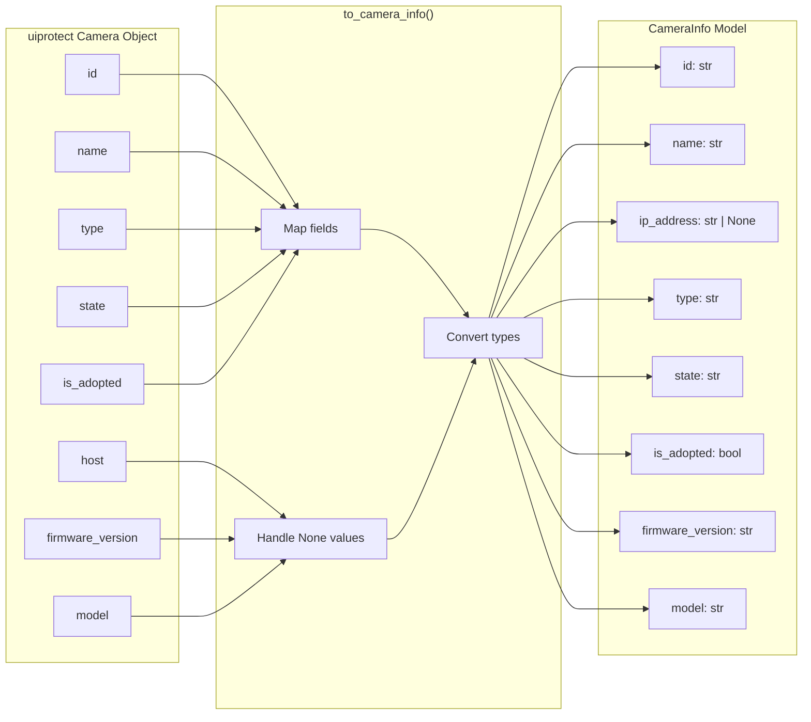

### Flow: Environment Variable Interpolation

```mermaid
flowchart TB
    subgraph Input["config.yaml with Variables"]
        A1["username: '${AXIS_USERNAME}'"]
        A2["password: '${AXIS_PASSWORD}'"]
    end

    subgraph Process["interpolate_env_vars()"]
        B1[Find ${VAR} patterns]
        B2[Lookup in os.environ]
        B3[Replace with values]
    end

    subgraph Output["Resolved Config"]
        C1["username: 'admin'"]
        C2["password: 'secret123'"]
    end

    A1 --> B1
    A2 --> B1
    B1 --> B2
    B2 --> B3
    B3 --> C1
    B3 --> C2
```
